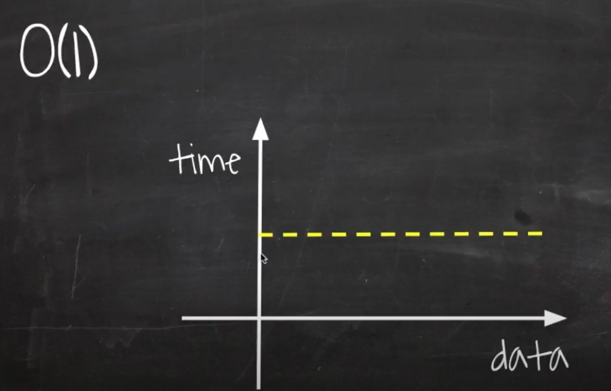
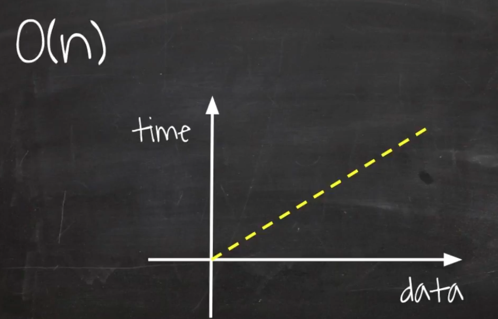
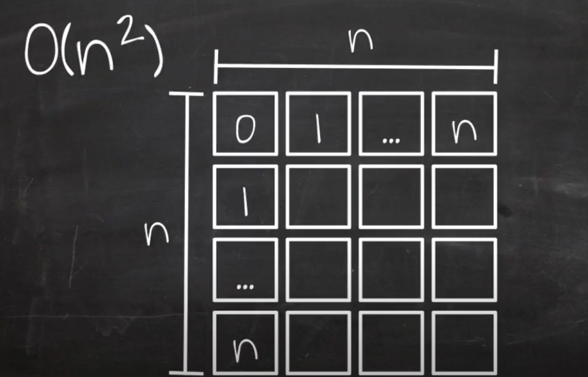
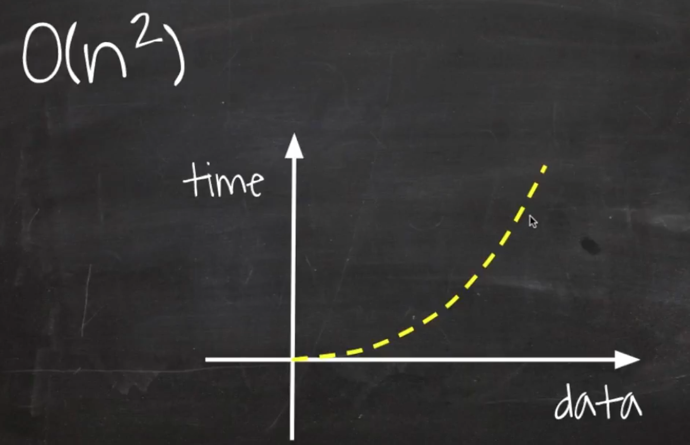
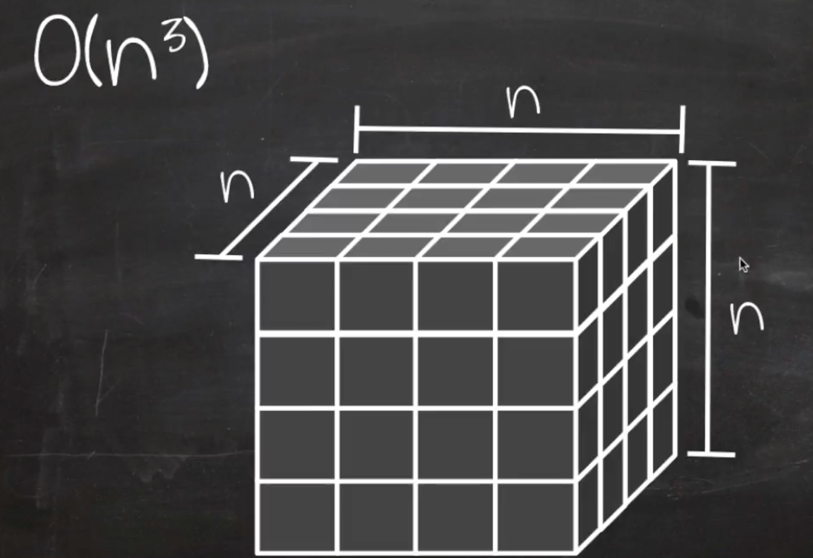
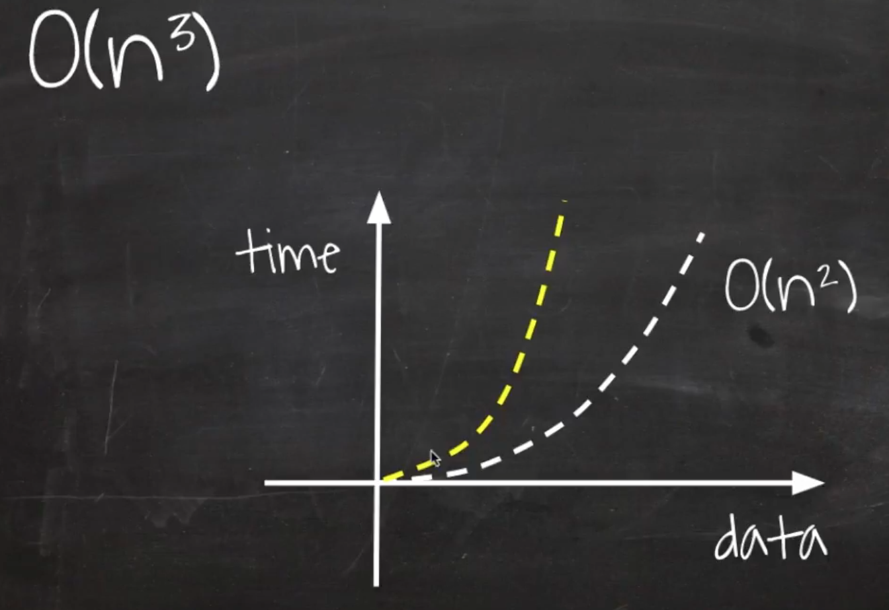
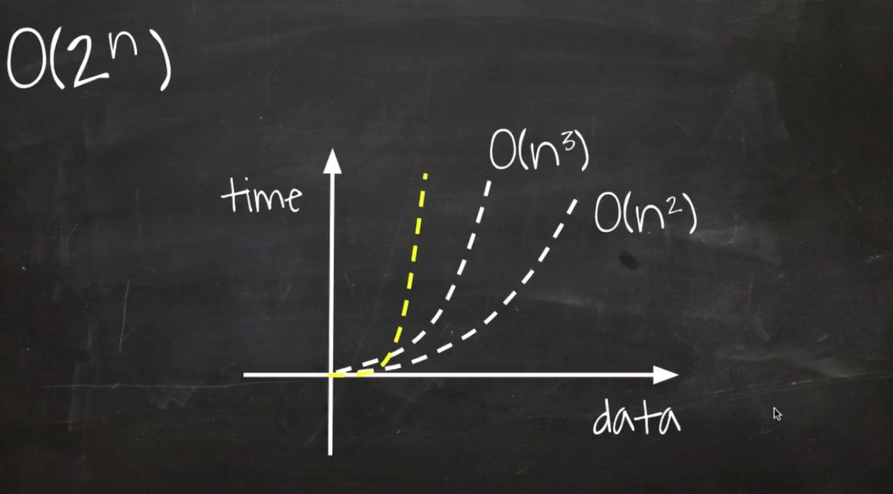
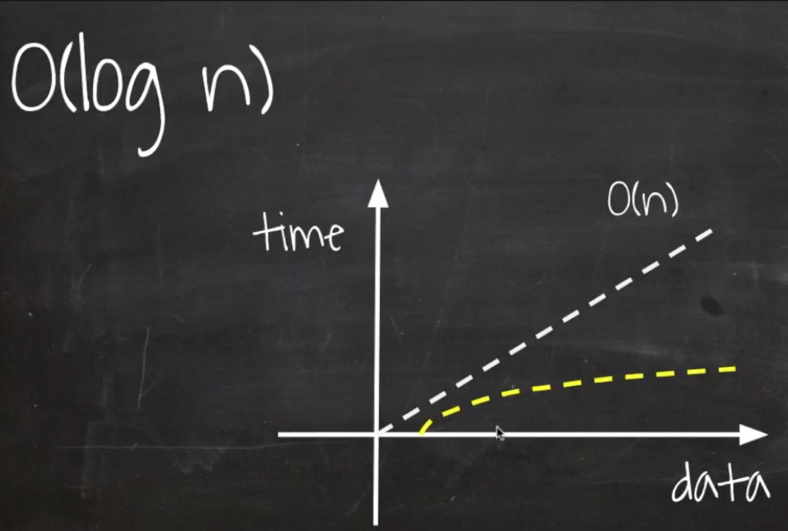

# BIG-O 표기법 (빅오 표기법)

## 목차

- [Big-O 표기법이란?](#big-o-표기법이란)
- [Big-O의 특징](#big-o의-특징)
- [시간복잡도](#시간복잡도)
- [알고리즘 내에서 간단하게 Big-O 계산하기](#알고리즘-내에서-간단하게-big-o-계산하기)

## Big-O 표기법이란?

- 알고리즘의 성능을 수학적으로 표현해주는 표기법
- **알고리즘을 시간과 공간 복잡도를 표현**
- **알고리즘의 실제 러닝타임 표시 x**
- **데이터나 사용자의 증가율에 따른 알고리즘 성능 예측을 목표**
- **점근적 상한선**에 대해 표기한다(worst-case 표기).

## Big-O의 특징

1. **상수**(와 같은 수)**는 모두 버린다.**

$$ o(2n) => o(n) $$

2. **최고차항만을 표기**한다.

$$ 5n^2 + 2n - m => o(n^2) $$

## 시간 복잡도

알고리즘에서의 시간 복잡도는 **입력값의 크기에 따른 처리 시간이 증가하는 정도**를 나타낸 것이다. 점근적 표기법을 사용하는데, 중요하지 않은 항과 상수 계수를 모두 제거해서 알고리즘의 실행 시간에서 중요한 부분인 **성장률**에 집중하는 것이다.

#### 시간 복잡도의 빠른 순서

[O(1)](#o1) > [O(log N)](#ologn) > [O(N)](#on) > [O(NlogN)](#onlogn) > [O(N^2)](#on2) > [O(N^3)](#on3) > [O(2^N)](#o2n)

### O(1)

###### constant time

입력 데이터의 크기에 상관하지 않고, 언제나 일정한 시간이 걸리는 알고리즘

<center></center>

##### 예시 코드

```javascript
function sayHello() {
  console.log("hello world!");
}
```

### O(N)

###### linear time

입력 데이터의 크기에 비례해서 처리 시간이 증가하는 알고리즘

<center></center>

##### 예시 코드

: 반복문이 한 번 있는 경우

```javascript
function printNumbers(arr, n) {
  for (let i = 0; i < n; i++) {
    console.log(arr[i]);
  }
}
```

### O(N^2)

###### quadratic time

입력 데이터의 제곱만큼 처리 시간이 증가하는 알고리즘

<div align="center" justify="space-between">
  
  
</div>

##### 예시 코드

: 반복문이 중첩되어 있는 경우

```javascript
function printNumbers(arr, n) {
  for (let i = 0; i < n; i++) {
    for (let j = 0; j < n; j++) {
      console.log(arr[i][j]);
    }
  }
}
```

### O(NM)

###### quadratic time

O(n^2)과 비슷해보이지만, n과 m의 크기에 각각 영향을 받으므로 다르다.

<div align="center" justify="space-between">
  
  
</div>

##### 예시 코드

: 반복문이 중첩되어 있는 경우

```javascript
function printNumbers(arr, n) {
  for (let i = 0; i < n; i++) {
    for (let j = 0; j < m; j++) {
      console.log(arr[i][j]);
    }
  }
}
```

### O(N^3)

###### polynomial / cubic time

O(n^2) 보다 데이터가 늘어남에 따라 처리 시간이 급격히 증가

<div align="center" justify="space-between">
  
  
</div>

##### 예시 코드

: 반복문 세개가 중첩되어 있는 케이스

```javascript
function printNumbers(arr, n) {
  for (let i = 0; i < n; i++) {
    for (let j = 0; j < n; j++) {
      for (let k = 0; k < n; k++) {
        console.log(arr[i][j]);
      }
    }
  }
}
```

### O(2^N)

###### exponential time

입력 데이터가 증가할 때마다 성장률이 두 배로 증가하는 알고리즘

<center></center>

##### 예시 코드

: 피보나치 수열이 대표적인 예이다.

```javascript
function fibonacci(n) {
  if (n <= 1) {
    return n;
  }
  return fibonacci(n - 1) + fibonacci(n - 2);
}
```

### O(logN)

###### logarithmic time

한 번 처리가 진행됨에 따라 검색 데이터의 양이 절반이 되는 알고리즘

<center></center>

##### 예시 코드

: 이진 탐색

```javascript
function binarySearch(targetValue, arr, min, max) {
  if (min > max) {
    return -1;
  }

  let idx = Math.floor((min + max) / 2);

  if (arr[idx] === targetValue) {
    return idx;
  } else if (arr[idx] < targetValue) {
    return binarySearch(targetValue, arr, idx + 1, max);
  } else {
    return binarySearch(targetValue, arr, min, idx - 1);
  }
}
```

### O(NlogN)

###### linearithmic time

로그 선형 알고리즘은 선형 알고리즘보다 약간 느리다.

<center></center>

##### 예시 코드

: 병합 정렬

```javascript
function mergeSort(arr) {
  if (arr.length === 1) {
    return arr;
  }
  let middle = Math.floor(arr.length / 2);
  let left = mergeSort(arr.slice(0, middle));
  let right = mergeSort(arr.slice(middle));

  return merge(left, rigtht);
}

function merge(arr1, arr2) {
  let i = 0;
  let j = 0;
  let result = [];

  while (i < arr1.length && j < arr2.length) {
    if (arr[i] < arr2[j]) {
      result.push(arr1[i]);
      i++;
    } else {
      result.push(arr2[j]);
      j++;
    }
  }

  while (i < arr1.length) {
    result.push(arr[i]);
    i++;
  }

  while (j < arr2.length) {
    result.push(arr[j]);
    j++;
  }
  return result;
}
```

## 알고리즘 내에서 간단하게 Big-O 계산하기

빅오 표기법의 특징으로 루프 밖에 있는 단순 연산들은 결국 상수항은 제외된다. 루프 안에 여러 개의 연산이 있다고 하더라도 가장 큰 차수 외에는 각 항의 계수를 포함한 모든 것들이 무시되기 때문에 **루프**와 **recursion** 횟수만 확인하면 된다.

```javascript
function printNumbers(arr, n) {
  for (let i = 0; i < n; i++) {
    for (let j = 0; j < n; j++) {
      console.log(arr[i][j]);
    }
  }
}
```

이 코드의 경우 n에 관련된 for loop가 두 번있다. n에 대한 1차식 두 개를 곱하는 것이다. 그러므로 연산의 개수에 대한 식은 2차식이 된다. 즉, 이 알고리즘의 시간 복잡도는 O(n^2)이다.

> 결국 알고리즘 내에서 Big-O 표기법은 **루프의 차수(깊이)와 직결된다**고 볼 수 있다.

## 참고

- [[자료구조] 빅오 표기법(Big-O notation)이란?](https://holika.tistory.com/entry/%EC%9E%90%EB%A3%8C%EA%B5%AC%EC%A1%B0-%EB%B9%85%EC%98%A4-%ED%91%9C%EA%B8%B0%EB%B2%95Big-O-notation%EC%9D%B4%EB%9E%80)
- [알고리즘의 시간 복잡도와 Big-O 쉽게 이해하기](https://blog.chulgil.me/algorithm/)
- [예를 들어 설명하는 Big-O 표기법](https://developerinsider.co/big-o-notation-explained-with-examples/)
- [알고리즘의 기초 Big-O Notation과 복잡도(Complextiy)](https://pstudio411.tistory.com/entry/Big-O%EC%99%80-%EB%B3%B5%EC%9E%A1%EB%8F%84Complexity)
