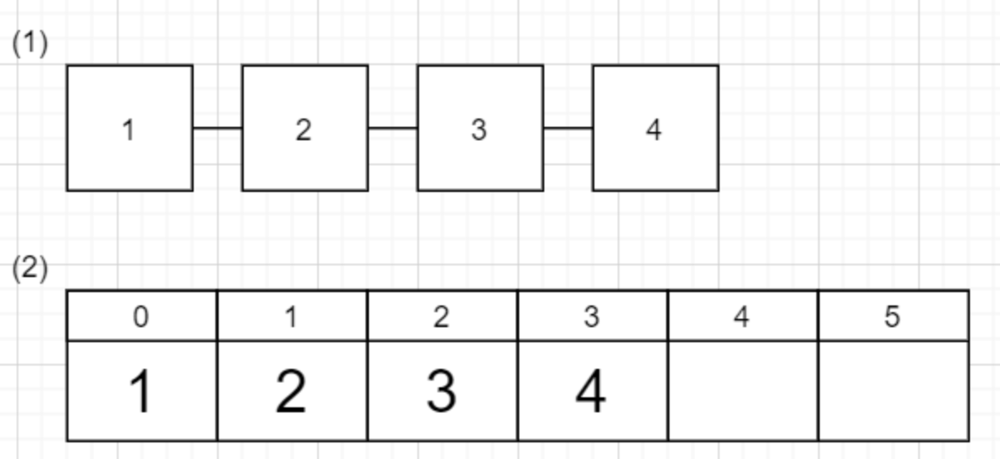

# 배열과 리스트 (Array & Linked List)

## 배열 (Array)

&nbsp;배열이란 연관된 데이터를 하나의 변수에 그룹핑해서 관리하기 위한 방법이다. 배열을 이용하면 하나의 변수에 여러 정보를 담을 수 있고, 반복문과 결합하면 많은 정보도 효율적으로 처리할 수 있다.
&nbsp;가장 기본적인 자료구조로 배열을 구성하는 **데이터들이 메모리의 연속된 공간에 순서대로 저장**된다. 배열은 연속된 공간에 저장되어 있어서 부여받은 인덱스를 통해 메모리의 주소를 계산할 수 있다. 즉, **빠르게 데이터에 접근**할 수 있다. 이것을 **Random Access(임의 접근)** 이라고 한다.

### 배열의 장점

- 원하는 데이터를 효율적으로 탐색 및 가져오는 속도가 빠르다. (배열 길이 상관 x) **=>** 읽어오는 속도는 `O(1)`시간이 걸린다.
- 복잡한 자료구조의 기초가 된다.
- 쉬운 생성 및 사용

### 배열의 단점

- 데이터를 저장할 수 있는 메모리 크기가 고정되어 있다.
- 데이터 추가 및 삭제가 비효율적이다. => 검색, 삽입, 삭제의 속도는 `O(n)`시간이 걸린다.
- 데이터 삽입, 삭제 시 배열의 재정렬이 필요하다.

### 배열의 활용

- 엑셀의 스프레드시트 처럼 직사각형 테이블, 수학적 벡터 (vector) 및 행렬 (matrix)를 구현하는 데 사용된다.
- 다른 데이터 구조(해시 테이블 등)에서 사용된다.

## 연결 리스트 (Linked List)

&nbsp;주소록이나 친구들 이름을 나열할 때 처럼 나열한 목록을 리스트라고 한다. Linked List는 배열과 달리 메모리상에 index에 의한 물리적 배치를 하지 않고 **참조 시스템을 사용**한다. **노드를 생성 후 해당 노드의 pointer에 의해 다음 노드를 연결**한다. 이를 통해 연결 리스트는 데이터 삽입/삭제시 데이터의 구조를 재정렬하지 않아도 되서 **데이터의 추가나 삭제가 빠르다**. 하지만 원하는 **데이터에 접근**하기 위해서는 처음 데이터부터 거쳐가야 하기 때문에 **시간이 오래 걸리게 된다**.

### 연결 리스트의 종류

&nbsp;위의 설명의 리스트는 기본적인 형태이다. 하지만 목적에 따라 확장해서 사용할 수 있다.

##### 1. 단순 리스트

노드가 하나의 링크 필드에 의해 다음 노드와 논리적으로 일렬로 연결된 구조를 단순 연결 리스트라고 한다.

- **이전 노드에 접근하기 위해선 첫 번째 노드부터 다시 순회해야함**

##### 2. 원형 리스트 (순환 리스트)

리스트의 마지막 데이터는 포인터를 가지고 있지 않지만, 마지막 데이터의 포인터가 맨 처음을 가리키게 하면 리스트가 원형으로 연결된다.

- 마지막 노드와 첫 번째 노드가 연결된 구조
- **이전 노드에 접근하기 위해서 계속 한 방향으로만 순회하면 된다.**

##### 3. 이중 연결 리스트 (양방향 리스트)

리스트에서 각 데이터가 포인터를 두개씩 가지게 해서 앞뒤 데이터를 가리키도록 한 리스트. 단순 연결 리스트에서 링크가 한 방향으로만 존재해서 앞의 리스트에 접근할 수 없는 문제를 해결하기 위해 등장했다.
다만 포인터 수가 늘어나므로 데이터 저장을 위한 메모리가 늘어나는 결점과 데이터 추가나 삭제 시에 변경해야 할 포인터가 늘어나는 단점이 있다.

- 각 노드가 앞 뒤로 연결됨
- **이전 노드에 직접 접근 (Direct Access) 가능**

### 리스트의 장점

- 새로운 요소들의 추가 및 삭제가 용이하고 효율적이다
- 배열처럼 추가, 삭제 시 재구성이 필요없다.
- 동적인 메모리 크기
- 메모리를 더 효율적으로 쓸 수 있기 때문에 대용량 데이터 처리 적합하다.

### 리스트의 단점

- 배열보다 메모리를 더 사용한다
- 처음부터 끝까지 순회하기 때문에 원하는 값을 비효율적으로 검색/가져온다.

### 리스트의 활용

- 메모리 크기가 정해져 있지 않을 때
- 데이터를 연속적으로 빠르게 삽입/제거가 필요 할 때
- 이미지 뷰어, 갤러리
- 음악 플레이어

## 배열 vs 리스트

배열과 리스트 모두 데이터를 1열로 나열하는 데이터 구조지만, 리스트는 접근에 시간에 걸리는 반면에 추가나 삭제가 간단하다. 반대로 배열은 접근은 간단하지만 추가나 삭제에 많은 시간이 걸린다. 무엇을 사용할지는 **어떤 작업을 자주하는 지를 고려해서 결정**하면 된다.

|              | 접근        | 추가        | 삭제        |
| ------------ | ----------- | ----------- | ----------- |
| 배열(Array)  | 빠름 / O(1) | 느림 / O(n) | 느림 / O(n) |
| 리스트(List) | 느림 / O(n) | 빠름 / O(1) | 빠름 / O(1) |

## 참고

- [Javascript를 이용한 Linked List 구현](https://velog.io/@kimkevin90/Javascript%EB%A5%BC-%EC%9D%B4%EC%9A%A9%ED%95%9C-Linked-List-%EA%B5%AC%ED%98%84)
- [개발자라면 꼭 알아야할 7가지 자료구조](https://velog.io/@jha0402/Data-structure-%EA%B0%9C%EB%B0%9C%EC%9E%90%EB%9D%BC%EB%A9%B4-%EA%BC%AD-%EC%95%8C%EC%95%84%EC%95%BC-%ED%95%A0-7%EA%B0%80%EC%A7%80-%EC%9E%90%EB%A3%8C%EA%B5%AC%EC%A1%B0#%EB%B0%B0%EC%97%B4-array)
