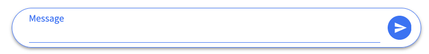

# 원티드 프리온보딩 프론트엔드 코스 3주차

## 들어가며

&nbsp;벌써 원티드X위코드 프리온보딩 프론트엔드 코스를 진행한지 절반이 지났다. 이제 반 정도 남았다는 생각에 시간이 참 빠르다는 생각이 든다. 절반이 지나니까 코스를 포기하는 사람이 몇몇 발생했다. 우리팀도 그래서 4명이었는데, 3명으로 줄어버렸다. 그래도 좋은 곳으로 가게 되셔서 어쩔 수 없던거니까!! 개발을 계속하다보면 언젠가 다른 곳에서 또 만날 수 있다고 생각한다.

## [ 팀과제 ] 간단한 채팅을 할 수 있는 메신저 구현

### :exclamation: 과제 조건 :exclamation:

- **Redux**를 통한 메시지 데이터 관리
- 메시지 데이터 모델: userId, userName, profileImgae, date

&nbsp;과제 조건을 보고 깜짝 놀라버렸다. Redux가 필수 조건이라니 당황스러웠다. 나는 아직 Context API도 사용해보지 못했기 때문이다. 이번 과제에서 Context API를 사용할 것을 예상하고 유튜브나 블로그 글을 찾아보면서 어떻게 사용하는 것인지 보기만 했고, 과제를 진행하면서 익혀보려고 했었다. 그런데 Redux라니!!

&nbsp;멘토님도 과제를 소개하면서 악명 높은 Redux를 하게 되었다고 말씀 하셨다. 최근에는 Redux가 아닌 Recoil을 사용한다고 하는데, 이번 과제에서 Redux를 조금이라도 익히게 된다면, Recoil과의 차이를 알아봐야 겠다.

## :raised_hands: 팀원들과의 합의 사항

### Figma를 통한 UI 개발

&nbsp;지금까지의 과제들은 이미지 파일이나 PDF 문서, 피그마를 제공함으로 디자인을 어떻게 만들어야 할지 별로 신경쓰지 않아도 됐었다. 그러나 이번 과제에서는 달랑 몇줄의 글로만 요구사항을 받았다. 통일감 있는 디자인으로 개발하기 위해 우리 팀은 피그마를 통해 UI 개발을 진행하기로 했다.

&nbsp;피그마를 다뤄 본 팀원은 없었지만, 설치하지 않고도 웹 브라우저 상에서 간단한 작업을 진행할 수 있었기 때문에 다행이었다. 피그마 최고!! 내가 디자이너라면 무조건 이거쓴다. 그리고 역시 진짜 좋은건 피그마에 있는 어떠한 이미지도 SVG로 가져올 수 있다는 점이다.

&nbsp;디자인 전공도 없고 배운 사람도 없을뿐더러 피그마조차 사용해본적이 다들 없기 때문에 황금 비율, 적절한 색상 그런건 아무도 몰라서 조금 서툴 수 있다. 그러나 디자인을 어느정도 정해두고 진행하다보니 통일감있는 UI개발이 가능해서 너무 좋았던 것 같다.

- **피그마 보러가기**: https://www.figma.com/file/dmdlBIixqcime5DQUtgeZu/week2_messenger?node-id=0%3A1

### Redux에서 관리할 데이터

&nbsp;다들 Redux를 처음 사용하기 때문에 정말 막막했다. 어떻게 공부라도 하고 모일까 했지만, Velopert 님의 [타입스크립트에서 Redux 프로처럼 사용하기](https://react.vlpt.us/using-typescript/05-ts-redux.html)라는 글을 보고 따라해가며 만들기로 결정했다. 이 글이 없었다면 우리는 정말 어떻게 되었을지, 너무나 설명이 잘 되어있는 글이다!! Redux를 처음 사용한다면 참고해보면 좋을 것 같다.

&nbsp;과제에서 리덕스를 통해 관리할 데이터로 메시지 모델만을 제시했지만, 우리는 하는 김에 세가지를 리덕스에서 관리하기로 했다.

- **Modal**
  - 모달의 열고 닫히는 상태
  - 모달 정보(내용, 실행할 함수)
- **User**
  - 유저의 로그인, 로그아웃 상태
  - 유저 정보(id, name, profileImage)
- **Message**
  - 대화목록을 가진 상태(ADD, DELETE, INIT)
  - 메시지 정보(유저 정보 + 메시지 id, content, date)

## :running: 프로젝트 진행

&nbsp;각자 컴포넌트를 개발하기 전에 우리는 아무도 redux를 사용해 본 경험이 없었기에, 다같이 모여서 redux 작업을 먼저 시작했다. 멘토님이 예시로 보여주신 repository가 있었지만, 과제에 연관된 내용이 있는 것도 아니었고, 폴더를 어떻게 정리하고 파일을 어떻게 나누는지 정도는 알 수 있었다.

## 1. Typescript에서 Redux 설정하기

### 패키지 설치하기

```bash
yarn add redux @types/react-redux typesafe-actions
```

타입스크립트에서 리덕스를 사용할 것이기 때문에, `@types/react-redux`와 `typesafe-actions`를 추가적으로 설치해주었다. `typesafe-actoins`는 설치하지 않아도 되지만, toolkit을 따로 설치하지 않을 것이고, 코드를 조금 더 깔끔하게 사용할 수 있을 것 같아서 사용해보기로 했다.

### Redux 파일 구성하기

```bash
.
src
 └─ store
     ├── actions
     ├── reducers
     └── index.ts
```

redux에 관련된 파일들을 담을 폴더를 만들었다. 우리는 store라는 폴더를 만들었고, 그 안에 action과 reducer를 담을 폴더를 만들었다.

- **store**: 프로젝트에서 단 1개, 큰 객체에 전역 상태가 모여있는 것이라고 생각하면 된다.
- **action**: state를 변화시킬 수 있는 행동 정보가 담긴 객체
- **reducer(dispatcher)**: action이 발행되면 store에 저장된 state가 업데이트 시키는 함수

### Action 만들기

우선 state 변화를 위해 어떠한 액션이 발생할지를 생각해야 했다. 우리는 모달, 유저, 메시지 정보를 가지고 있으니까 아래와 같은 액션이 필요했다.

- 모달이 열고 닫히는 액션
- 유저가 로그인, 로그아웃하는 액션
- 메시지가 추가되고 제거되거나 초기상태로 돌아가는 액션

#### Action Type 만들기

액션을 사용하기 위해 타입을 지정해줘야 했고, 온전하게 Type을 정의하기 위해서 typesafe-actions의 `ActionType`을 사용해야 했다. actions 폴더 내에 액션 타입을 정의할 types.ts파일을 만들었다. (파일이 길기 때문에 예시는 가장 핵심적인 message에 관련된 코드만 작성)

```ts
// types.ts
export const INIT_MESSAGES = "INIT_MESSAGES";
export const ADD_MESSAGE = "ADD_MESSAGE";
export const DELETE_MESSAGE = "DELETE_MESSAGE";
```

처음에는 TypeScript의 타입을 지정하는 건가 생각했지만, 다른거라고 생각하면 된다! 그리고 추후에 알게된 것인데, 만약 typesafe-actions를 사용하지 않는다면 뒤에 `as const`를 붙여줘야 한다고 한다.

#### 액션 구현하기

```ts
// actions/message.ts
import { ActionType, createAction } from "typesafe-actions";
import {
  ADD_MESSAGE,
  DELETE_MESSAGE,
  INIT_MESSAGES,
} from "~store/actions/types";
import type { MessageType, DeleteType } from "~types/index";

export const initMessage = createAction(INIT_MESSAGES)();
export const addMessage = createAction(ADD_MESSAGE)<MessageType>();
export const deleteMessage = createAction(DELETE_MESSAGE)<DeleteType>();

const actions = { initMessage, addMessage, deleteMessage };
export type MessageActionType = ActionType<typeof actions>;
```

&nbsp;벨로퍼트님의 글을 보고 따라하는데, createStandardAction을 사용하셔서 사용해보려고 했지만, 잘 되지 않아서 createAction을 사용했다. 찾아보니 버전이 달라지면서 createStandardAction이 createAction으로 통합된 것으로 보인다.

&nbsp;액션을 사용하기 위해서는 액션을 발행하는 액션함수를 만들어야 하는데, createAction은 일일이 액션함수를 정의하는 것을 편하게 만들어준다. 예를들어 addMessage라는 액션을 발행하는 함수를 만들어보자.

```ts
// createAction 사용 x
export const addMessage = (message: MessageType) => {
  type: ADD_MESSAGE,
  payload: message
};

// createAction 사용 시
export const addMessage = createAction(ADD_MESSAGE)<MessageType>();
```

이런 식으로 정의해야 할 것을 위와 같이 간단히 한 줄로 만들 수 있다. createAction은 첫번째 인자로 액션의 `type`, 두번째 인자로 `payload`를 받는다. **payload는 액션 함수의 파라미터**인데, 여기서 필요하지 않아서 작성하지 않았다.뒤의 괄호는 액션의 타입이지만, 미리 타입을 정의했기 때문에 자동으로 적용되는 것 같으므로 비워둬도 되는 것 같다.

### Reducer 구현하기

reducer는 발행된 액션을 통해 실질적으로 어떠한 기능을 하는지 구현하는 파일이다.

```ts
// reducers/message.ts
import { createReducer } from "typesafe-actions";
import {
  ADD_MESSAGE,
  DELETE_MESSAGE,
  INIT_MESSAGES,
} from "~store/actions/types";
import { INITIAL_MESSAGES } from "~constants/message";
import type { MessageType } from "~types/index";
import type { MessageActionType } from "~store/actions/message";

export type MessageStateType = {
  messages: MessageType[];
};

const INITIAL_STATE: MessageStateType = {
  messages: INITIAL_MESSAGES,
};

const messages = createReducer<MessageStateType, MessageActionType>(
  INITIAL_STATE,
  {
    [INIT_MESSAGES]: (state) => INITIAL_STATE,
    [ADD_MESSAGE]: (state, action) => ({
      messages: [...state.messages, action.payload],
    }),
    [DELETE_MESSAGE]: (state, action) => ({
      messages: state.messages.filter(
        ({ messageId }) => messageId !== action.payload.messageId
      ),
    }),
  }
);

export default messages;
```

#### 필요한 기능, 타입 및 객체 가져오기

메시지 reducer를 구현하기 위한 파일들을 import 해주고 작성하는데, types.ts에서 정의한 액션 타입들을 불러와주고 액션을 구현할 때 만든 MessageActoinType을 가져온다. 그리고 createReducer를 typesafe-actions에서 가져오는데, 이게 없었다면 우리는 reducer함수를 만들고 switch문을 통해 작성해야 한다.

<details><summary>예시 코드 보기</summary><div markdown="message-reducer">

아마 이렇게 작성하면 되지 싶은데, 해보지 않아서 알 수 없다...

```ts
const reducers = () => {
  case INIT_MESSAGE:
    return (state) => INITIAL_MESSAGE;
  case ADD_MESSAGE:
    return (state, action) => ({ messages: [...state.messages, action.payload]});
  case DELETE_MESSAGE:
    return state.filter(({messageId}) => messageId !== action.payload.messageId);
    default:
      return state;
  }
}
```

</div></details>

#### initialState 정의

```ts
const INITIAL_STATE: MessageStateType = {
  // 초기 상태에 메시지가 담겨 있음
  messages: INITIAL_MESSAGES,
};
```

요구사항에서 기본적으로 채팅 창에 세명의 유저가 다섯 건의 메시지를 주고 받는 상황이 적혀있었기 때문에, INITAL_MESSAGES에 대화 목록을 구현한 후에 messages의 초기 상태로 넣어주었다.

#### Reducer 함수 구현

```ts
const messages = createReducer<MessageStateType, MessageActionType>(
  INITIAL_STATE,
  {
    [INIT_MESSAGES]: (state) => INITIAL_STATE,
    [ADD_MESSAGE]: (state, action) => ({
      messages: [...state.messages, action.payload],
    }),
    [DELETE_MESSAGE]: (state, action) => ({
      messages: state.messages.filter(
        ({ messageId }) => messageId !== action.payload.messageId
      ),
    }),
  }
);
```

reducer를 구현하면서 몇 가지 알게되었다. **createRedcer함수에는 두 가지 타입이 필요하고 두가지 매개변수를 받는다.**

- 타입: state에 대한 Type, 액션에 대한 타입
- 매개변수: 초기 상태, 객체

이 매개변수로 들어가는 객체에 우리가 정의한 액션이 발행되면 실행할 함수를 적어줘야 한다. 그리고 이 함수는 reducer의 세가지 원칙 중 하나로 순수함수로 작성되어야 한다.

<details><summary><b>Reducer의 세가지 원칙</b></summary><div markdown="reducer-principle">

1. **전체 상태값이 하나의 객체로 표현된다.** (구현한 React 앱에 state가 하나라는 뜻)
2. **상태값(state)은 읽기 전용이다.** (state를 직접 조작하지 않고, setState를 이용해서 변경하듯이)
3. **상태값(state)은 순수 함수에 의해서만 변경되어야 한다.**

- **순수함수**
  - 같은 input이 들어오면 항상 같은 output을 반환하는 함수
  - 상태값만을 변경하는 함수(reducer가 여기에 해당한다)
  - 순수함수가 아닌 함수로 Date, random, fetch 등이 있다.

</div></details>

#### Reducer 내보내기

```ts
// reducers/index.ts
import { combineReducers } from "redux";
import modal from "./modal";
import user from "./user";
import messages from "./message";

const rootReducer = combineReducers({
  modal,
  user,
  messages,
});

export default rootReducer;
export type RootStateType = ReturnType<typeof rootReducer>;
```

우리가 만든 reducer를 사용하기 위해 이제 reducer를 내보내줘야 한다. 예시에는 작성하지 않았지만, 세가지 reducer(모달, 유저, 메시지)를 만들었기 때문에 `combineReducers`를 사용해서 묶어서 내보내 준다. 추가적으로 TypeScript이기 때문에 밖에서 reducer를 사용할 때 필요한 타입도 내보내준다.

### Store 생성

```ts
// index.ts
import { createStore } from "redux";
import rootReducer from "./reducers";

const store = createStore(rootReducer);

export default store;
```

이제 Store 폴더 내의 index.ts에서 `createStore`를 이용해 redux의 store를 만들어준다. 만들어둔 rootReducer를 가저와서 인자로 넣어주기만 하면된다! **redux는 store를 통해서 state를 공유**하기 때문에 이 store를 꼭 만들어줘야 한다!!

#### store 전달하기

```tsx
// index.tsx
import React from "react";
import ReactDOM from "react-dom";
import { Provider } from "react-redux";
// ~는 craco를 사용해 절대 경로를 설정했기 때문
import store from "~store/index";
import App from "./App";

ReactDOM.render(
  <React.StrictMode>
    <Provider store={store}>
      <GlobalStyle />
      <App />
    </Provider>
  </React.StrictMode>,
  document.getElementById("root")
);
```

앱 root에 위치한 index.tsx에서 우리가 만들 App을 `Provier`로 감싸준다. **Provider로 감싼 후에 store를 넘겨주면 그 하위에 있는 모든 컴포넌트들은 이제 상태를 공유할 수 있게 된다.**

&nbsp;정말 길고도 길었다... 아무것도 모르는 상태에서 하려니까 셋이서 서너시간은 쓴 것 같다. 서로 찾아가면서 이렇게 해보고, 저렇게 해보고 하면서 만들었다. 처음 이 코드를 작성했을 때는 오류 메시지가 뜨지 않는 것을 목표로 만들었다. 코드를 작성하면서도 내가 지금 제대로된 코드를 작성한 것인지 이게 동작이 어떻게 될 것인지 알지 못해서 정말 답답하게 코드를 작성했던 것 같다.

&nbsp;하지만 나쁘지 않은 경험이었고, 제대로 잘 만들었기 때문에 괜찮았다. redux의 코드가 어떤 구조인지를 프로젝트를 진행하면서 redux를 사용하게 될 때, 제대로 알게 된 것 같다. 막상 사용할 때는 '와... 이렇게 쉽게 돼?' 하면서 사용하게 되서 이제 다른 프로젝트에서도 리덕스를 적극적으로 사용해봐야겠다는 생각이 들었다.

<div align="center">

</div>

## 2. Messenger에 필요한 Component 구현하기

Redux에 필요한 설정을 마쳤으니 이제 Messenger를 구현하기 위한 컴포넌트들을 만들어야 했다. 우리는 항상 컴포넌트를 제작할 때 협업을 쉽게 하기 위해, 기능을 가지지 않은 최소 단위의 컴포넌트인 base 컴포넌트와 한가지 역할을 하는 domain 컴포넌트로 나누어서 제작을 한다.

### 컴포넌트 구성

#### base

- **Avatar**: 유저 이미지가 담길 컴포넌트
- **Button**: 앱에서 사용할 여러가지 버튼들
- **Icon**: 앱에서 사용할 여러가지 아이콘들
- **Input**: 로그인 시 userName을 입력받을 input
- **TextArea**: 메신저의 채팅창 역할을할 textarea
- **Container**: 로그인 화면이나 메신저가 담길 컨테이너 역할을 할 컴포넌트

#### domain

- **Modal**: 나가기 버튼이나 메시지 삭제 버튼 클릭 시 생성될 모달 창
- **Login**: 로그인 화면을 보여주는 컴포넌트
- **Message**: 유저 정보와 메시지 id 및 내용, 날짜를 가지고 있는 컴포넌트
- **Messenger**: 실질적으로 채팅할 수 있는 컴포넌트

&nbsp;나는 이번에 base에서 Button과 Icon을 맡았고, domain에서는 Messenger 컴포넌트를 맡게 되었다. 팀 프로젝트 진행 시에 항상 체크박스나 input 관련된 것만 맡아서 진행했었는데, props에 따라 바뀌는 버튼을 구현해보고 싶어서 하고 싶다고 했다.

&nbsp;그리고 메신저 컴포넌트를 하겠다고 했는데, 팀원분들이 나보다 항상 어려운 부분을 맡아주셨기 때문이다. 이제는 내가 가장 어렵다고 생각하는 부분을 만들어서 도움을 드리고 싶었기에 메신저 컴포넌트를 맡게 되었다.

### Button 컴포넌트 구현

&nbsp;사실 버튼 컴포넌트를 구현하는 것은 어렵지 않다. props로 버튼의 스타일을 조정할 수 있게 하고, 원하는 텍스틀 입력하면 버튼의 내용으로 보여주고, onClick 이벤트를 받기만 하면 되기 때문이다. 그러나 이번에 공통으로 사용될 버튼을 구현하면서 신경써야 할 부분이 몇가지 알게되었다.

#### 버튼 CSS

&nbsp;그기능 구현을 하는 부분이 아니다보니 버튼에 hover했을 때와 click 이벤트가 일어났을 때, 효과를 결정하는 것에 시간을 조금 더 쓰게 되었다. 일반적인 디자인은 어떨까 찾아보는 중 내가 찾아본 글에는 hover 시에 조금 더 연한색으로 바뀌고 클릭했을 때 어두운 색으로 변하는 디자인들이어서 그렇게 css를 적용했다. 최대한 색을 덜쓰고 그림자도 덜 줘서 flat한 디자인으로 만들어서 팀원들에게 보여줬다.

&nbsp;그러나 팀원 분들 중 한 분이 호버 시에 색 전환이 조금 어색하다고 하셨다. 역시 사람마다 같은 디자인을 보고 느끼는게 다른 것 같다. 그 분이 Material UI의 버튼을 예시로 보여주시면서 호버 시에 조금 더 어두운 색으로 변하는 게 좋을 것 같다고 하셨다. 나도 그 디자인이 마음에 들었고, 적용해봤는데 훨씬 마음에 들게 되었다. 감사합니다. :smile:


#### 버튼과 form 연결하기

&nbsp;이건 버튼을 만들고 나서 다른 컴포넌트들과 합치는 중에 알게되었다. 로그인 기능을 구현할 때, 버튼이 form태그 안에 있기 때문에 onClick이벤트가 일어나면 form이 submit되어야 했다. 그리고 enter를 쳐도 form이 submit되어야 했는데, 동작하지 않았다. 버튼과 form이 연결되지 않아서였다.

```tsx
//button.tsx
const Button = ({
  children,
  form,
  type = "button",
  contained,
  onClick,
  ...props
}: ButtonProps) => {
  return (
    <StyledButton
      form={form}
      type={type}
      contained={contained}
      onClick={onClick}
      {...props}
    >
      {children}
    </StyledButton>
  );
};
```

&nbsp;버튼과 form을 연결하려면 버튼에 form 이라는 속성이 필요했다. **사용할 form의 `id`와 버튼의 `form` 속성의 값을 일치시키고, button의 `type`을 `submit`으로 만들어주면 form과 버튼이 연결되어 enter나 클릭 시에 submit이 가능했다.** 이렇게 하면 onClick이벤트도 필요하지 않았다. 따로따로 구현해야 할 줄 알았는데, 이런 방법이 있었다니 정말 좋은 것을 알게되었다!!! :smile:

### Icon 컴포넌트 구현

&nbsp;위의 버튼과 하나로 묶어서 구현할까 했지만, 사용할 아이콘이 많기에 따로 구현하게 되었다. 동작은 비슷하다. 클릭하면 어떠한 동작이 실행되는 컴포넌트였다. 그러나 이번에 Icon 컴포넌트를 구현하면서, 재밌는 것 두가지를 알게 되었다.

#### SVG를 컴포넌트로 만들기

&nbsp;피그마를 사용해서 UI 디자인을 했기 때문에, 미리 정한 아이콘이 있었다. 그리고 그 아이콘들을 SVG로 가져와서 사용하려고 했다. 그런데 이것들을 다 하나하나 따로 함수로 감싸서 컴포넌트로 만들어야 하나? 생각했다. SVG태그의 코드는 굉장히 길고 알기 어렵다. 그러한 코드가 컴포넌트 안에 있는게 나는 마음에 들지 않았고, 다른 방법을 찾아보게 되었다.

&nbsp;그러던 중 [SVG 다루기](https://kyounghwan01.github.io/blog/React/handling-svg/)라는 글을 보게 되었다. 정말 글을 잘 쓰셔서 검색 중에 평소에도 몇번 봤던 블로그인 것 같은데, 이번에도 도움을 받게 되었다.

```tsx
import { ReactComponent as Send } from "~assets/icon-send.svg";

<Send />;
```

저 위의 import문 한 줄이면 SVG를 간단하게 컴포넌트로 바꿀 수 있었다. 정말... 너무 신기해!! 보고서 바로 따라서 적용해봤다. 최고다... 이렇게 깔끔하게 코드를 짤 수 있다니 행복했다. 그리고 크기나 색깔도 아주 간단하게 변경할 수 있었다.

```svg
<svg width="current" height="current" viewBox="0 0 33 34" fill="current" xmlns="http://www.w3.org/2000/svg">
<path d="M16.6667 0C18.8554 0 21.0226 0.431096 23.0447 1.26867C25.0668 2.10625 26.9041 3.33391 28.4518 4.88155C29.9994 6.4292 31.2271 8.26652 32.0647 10.2886C32.9022 12.3107 33.3333 14.478 33.3333 16.6667C33.3333 21.0869 31.5774 25.3262 28.4518 28.4518C25.3262 31.5774 21.0869 33.3333 16.6667 33.3333C14.478 33.3333 12.3107 32.9022 10.2886 32.0647C8.26652 31.2271 6.4292 29.9994 4.88155 28.4518C1.75595 25.3262 0 21.0869 0 16.6667C0 12.2464 1.75595 8.00716 4.88155 4.88155C8.00716 1.75595 12.2464 0 16.6667 0V0ZM10 9.51667V15.0833L21.9 16.6667L10 18.25V23.8167L26.6667 16.6667L10 9.51667Z" fill="current"/>
</svg>
```

svg태그에서 바꾸고 싶은 속성을 `current`로 변경해주기만 하면된다. current로 바꿔준 후에 코드에서 아래와 같이 작성한다.

```tsx
<Send width="36" height="36" current="blue">
```

이런식으로 컴포넌트에서 props로 내려주기만 하면 간단히 색이나 크기를 바꿀 수 있었다!!

#### 컴포넌트 이름을 props를 통해 동적으로 변경하기

&nbsp;SVG를 컴포넌트로 만들고 나서 밖에서 props로 아이콘의 이름을 내려주면 만들어둔 아이콘 컴포넌트가 보여지게 만들고 싶었다. 그러나 아이콘의 이름을 props로 받아서 삼항 연산자로 조건부 렌더링을 하게 만들면 코드가 살짝 지저분해지게 된다.

```tsx
const Icon = ({ name, size, color, onClick }: IconProps) => {
  return (
    <StyledIcon name={name} size={size} onClick={onClick}>
      {name === "send" ? (
        <Send width="size" height="size" fill="color" />
      ) : name === "reply" ? (
        <Reply width="size" height="size" fill="color" />
      ) : (
        <Delete width="size" height="size" fill="color" />
      )}
    </StyledIcon>
  );
};
```

&nbsp;이렇게 사용할 아이콘이 세개만 되어도 삼항연산자를 중첩으로 사용하게 된다. 그래서 나는 props를 통해서 컴포넌트의 이름을 동적으로 변경할 수 있다면 좋겠다고 생각했고, 시도하게 되었다. 그러나 계속 컴포넌트의 이름은 대문자로 시작해야 한다는 에러가 발생했다. 그래서 props로 받을 아이콘의 이름을 대문자로도 바꿔보고 여러 시도를 해봤는데, 쉽지 않았다.

```tsx
const icons: Icons = {
  send: Send,
  reply: Reply,
  delete: Delete,
};

const Icon = ({ name, size, color, onClick }: IconProps) => {
  const SpecificIcon = icons[name];
  return (
    <StyledIcon name={name} size={size} onClick={onClick}>
      <SpecificIcon name={name} size={size} color={color} />
    </StyledIcon>
  );
};
```

&nbsp;그러던 중 한가지 방법을 찾게 되었다. 객체를 이용하면 컴포넌트의 이름을 props로 받아서 변경할 수 있었다. 컴포넌트 부분의 코드가 너무 깔끔해져버렸다. 딱 내가 원하던 방식의 코드여서 너무나 만족스럽다!!

### Messenger 컴포넌트 구현

&nbsp;이번 기업 과제의 메시지 컴포넌트를 비롯해 핵심적인 부분중 하나였다. 실제로 내가 이 부분을 하겠다고 나섰지만, 할 수 있을지 너무나 걱정이었지만 다행인 것은 메시지 컴포넌트를 맡으신 분이 메시지를 삭제할 수 있는 기능을 만들어두셨었다. 정말 너무너무 최고~~~!!!

<div align="center">

</div>

#### 메시지를 입력 Form 구현

&nbsp;메시지의 입력을 보낼 수 있어야 뭘 시작도 할 수 있으니, 이것부터 하기로 했다. 우선 다른 분이 만들어두신 `textarea` 컴포넌트가 있었다. 이를 이용해서 나는 form 태그 안에 이 컴포넌트와 Icon 컴포넌트를 넣어서 하나의 입력창을 만들어냈다. CSS때문에 좀 골치 아팠다...:cry:



#### 대화목록에 메시지 추가기능 구현

&nbsp;onChange, onClick 이벤트를 이용해서 메시지를 입력하면 데이터를 가져올 수 있게 만들었다. form에서 submit이 일어나면 만들어둔 redux의 대화목록 상태에 저장할 수 있게 만들어야 했다. 드디어 만드느라 고생한 redux를 사용하는 순간이었다!!

```tsx
// messenger.tsx
import { useSelector, useDispatch } from "react-redux";
import { RootStateType } from "~store/reducers";
import type { MessageType } from "~types/data";

const Messenger = () => {
  const { user } = useSelector((state: RootStateType) => state.user);
  const { messages } = useSelector((state: RootStateType) => state.messages);
  const dispatch = useDispatch();
};
```

&nbsp;유저와 메시지 데이터를 가져오기 위해 `useSelector`를 사용했고, 메시지를 추가하는 함수를 불러오기 위해 `useDispatch`를 사용했다. 저기 useSelector의 사용법 때문에 꽤나 애를 먹었다. Redux 작업에 너무 머리를 많이 써서 그런가 아무런 생각도 않고, 당연히 useState처럼 제네릭으로 타입을 정의해야 된다고 생각했다.

```tsx
// 잘못된 코드
const { user } = useSelector<RootStateType>((state) => state.user);
```

&nbsp;이렇게 작성해두고 왜 안되는거지? 하고 있었다. 여기저기 글을 찾아보았지만, 이미 글은 머리에 들어오지 않는 상태였고, 만드느라 고생한 리덕스가 쓸모 없어지는 건가... 하면서 슬퍼하고 있었다. :cry: 그러나 생각해보면 당연한 걸 놓치고 있었다. 우리가 정의한 user가 담긴 reducer 안에 state가 있었다. 그리고 그 state는 reducer들을 합쳐놓은 RootReducer였기에 당연히 state에 타입을 지정해주어야 했다. 정말 바보...

```tsx
// 입력할 메시지가 담길 곳
const [chatMessage, setChatMessage] = useState<string>("");

const handleChange = useCallback(
  (e: React.ChangeEvent<HTMLInputElement>) => {
    setChatMessage(e.target.value);
  },
  [chatMessage]
);
```

보낼 메시지를 입력할 textarea 태그에 onChange 이벤트로 handleChange함수를 전달해주었다. textarea에 값이 입력되면 chatMessage에 변한 값이 담기게 된다.

```tsx
const handleBtnSubmit = useCallback(
  (e: React.MouseEvent<HTMLButtonElement>) => {
    e.preventDefault();
    // 버튼이 클릭되면 입력한 메시지를 제출할 함수 호출
    submitForm();
  },
  []
);
```

버튼을 클릭하면 전송이 될 수 있도록, 버튼 부분에 onClick 이벤트로 handleBtnSubmit을 연결해주었다.

```tsx
// messenger.tsx
const submitForm = useCallback(() => {
  // 불변성을 유지하기 위한 메시지 객체
  const message: MessageType = {
    userId: user.userId,
    userName: user.userName,
    profileImage: user.profileImage,
    messageId: uuid(),
    content: chatMessage,
    date: new Date(),
  };
  // 대화목록에 새로운 메시지 추가
  dispatch(addMessage(message));
  // submit 시에 textarea 비워주기
  setChatMessage("");
}, [chatMessage]);
```

&nbsp;form이 submit 될 때, 동작할 함수를 작성했다. 우리가 리덕스에 만들어둔 `addMessage`란 함수는 메시지들이 모인 대화목록에 새로 생성된 메시지를 추가하는 함수였다. 그래서 기존과 동일한 형태의 message를 넣어주기 위해 객체를 만들어서 인자로 넣어주었다.

&nbsp;생각보다 코드는 간단했는데, 이게 동작할까? 싶었다. 그런데 이게 웬일, 너무도 깔끔하게 동작해버렸다. 그냥 막 추가가 됐다. 이제 리덕스가 어떻게 동작하고 왜 그런 코드들이 필요했는지 조금 알 것 같았다. 이거 만들고 메시지 추가 몇번을 해봤는지 모르겠다. :smile:

#### 엔터키로 전송되게 하기 & 멀티라인 입력 기능

&nbsp;위처럼 코드를 작성했는데, 문제가 발생했다. form 안에 버튼이 존재했기에 당연히 버튼을 클릭하면 form의 submit 이벤트가 연동될 줄 알았는데, 연결되지 않아서 `enter` 키를 눌러도 아무런 반응을 하지 않고, `textarea` 태그에서 줄바꿈만 일어났다.

```tsx
const handleUserKeyPress = useCallback(
  (e: React.KeyboardEvent<HTMLTextAreaElement>) => {
    if (e.key === "Enter" && !e.shiftKey) {
      e.preventDefault();
      submitForm();
    }
  },
  [user, chatMessage]
);
```

&nbsp;그래서 따로 엔터키를 눌러도 `submit`이 일어나도록 따로 함수를 작성해야했다. `textarea` 태그에 `onKeyPress`이벤트로 `handleUserKeyPress`라는 함수를 연결해주었다. 그리고 조건문으로 `enter`가 입력되면 `submitForm()`함수를 호출하도록 만들어주었다. 그러나 `textarea` 태그의 멀티라인 입력기능을 이용할 수 없었기에, `enter가` 눌려도 `shift`키가 눌리지 않았을 때만 이란 조건을 만들어주어서 해결했다.

&nbsp;작업을 하다 후에 알게되었는데, 이렇게 함수를 두개를 만들 필요가 없었다. `form` 태그에서 엔터를 치면 `submit`이벤트가 일어나지 않아서 따로 함수를 작성한거였는데, 아래와 같은 방법으로 **버튼과 폼을 연결하면 해결되는 문제**였다.

- 폼의 `id`와 버튼의 `form` 속성을 동일한 값으로 작성한다.
- 버튼의 `type`을 `submit`으로 지정한다.
- `form`에 `onSumbit` 이벤트로 submitForm 함수를 전달해준다.

#### 메시지 입력 내용이 없을 시에 전송 막기

&nbsp;요구사항 중에 메시지 입력 내용이 없으면 전송을 못하게 해야 한다는 조건이 있었다. 그러나 지금 상태로 엔터나 버튼을 클릭하면 입력한 내용이 없어도 전송된다. 이를 막기 위해서 `form`의 내장 속성인 `required`를 사용해보려고 했다. 입력한 내용이 없으면 내용을 입력하라는 알림 문구가 나오기는 했다. 그러나 이 동작이 계속 중복해서 여러번 반복되어서 내용을 입력해도 내용을 입력하라는 알림 문구가 나타났다.

&nbsp;지금 생각하면 useMemo를 사용해서 해결할 수 있었을 것 같은데, 그때는 방법이 떠오르지 않아서 `required`사용을 포기하고 직접 에러 메시지를 띄우기로 결정했다. 일단 에러가 난 상황을 담을 상태를 하나 만들어야 했다.

```tsx
const [chatFormError, setChatFormError] = useState<boolean>(false);
```

그리고 만드는 김에 입력 내용이 없다면 에러를 나타내기 위해 폼의 색깔을 변경하고 채팅창이 흔들리는 애니메이션을 주기로 결정했다. 일단 흔들리는 애니메이션인 wiggling을 만들었다.

```tsx
const wiggling = keyframes`
  0% {
    transform: rotate(0deg);
  }
  10%{
    transform: rotate(3deg);
  }
  20%{
    transform: rotate(-3deg);
  }
  30%{
    transform: rotate(2deg);
  }
  40%{
    transform: rotate(-2deg);
  }
  50%{
    transform: rotate(1deg);
  }
  60%{
    transform: rotate(-1deg);
  }
  70%{
    transform: rotate(0deg);
  }
  100%{
    transform: rotate(0deg);
  }
`;
```

`styled-compoents`에서 animation을 조건부로 어떻게 사용해야 할지 몰라서 여러가지로 시도하면서 정말 막막했는데, 위에 만들어둔 상태값을 이용하면 쉽게 해결할 수 있었다(처음에는 새로운 상태를 만들지 않고 문제를 해결하려고 했었다).

```tsx
const ChatForm = styled.form<{ chatFormError: boolean }>`
 ...
  ${(props) =>
    props.chatFormError
      ? css`
          border: 1px solid red;
          animation: ${wiggling} 1s;
        `
      : css`
          animation: none;
        `}
 ...
`;

const ChatLabel = styled.label<{ chatFormError: boolean }>`
  ...
  color: ${(props) =>
    props.chatFormError ? COLORS.ERROR_COLOR : COLORS.PRIMARY};
`;
```

이제 에러 상태의 애니메이션과 스타일을 만들어주었으니 남은건 연결만 해주면 됐다.

```tsx
const handleErrorEffect = useCallback(() => {
  setChatFormError(true);
  setTimeout(() => {
    setChatFormError(false);
  }, 1000);
}, []);

const handleBtnSubmit = useCallback(
  (e: React.MouseEvent<HTMLButtonElement>) => {
    e.preventDefault();
    chatMessage === "" ? handleErrorEffect() : submitForm();
  },
  [user, chatMessage]
);

const handleUserKeyPress = useCallback(
  (e: React.KeyboardEvent<HTMLTextAreaElement>) => {
    if (e.key === "Enter" && !e.shiftKey) {
      e.preventDefault();
      chatMessage === "" ? handleErrorEffect() : submitForm();
    }
  },
  [user, chatMessage]
);
```

&nbsp;위에서 버튼을 클릭했을 때와, enter를 입력했을 때에 `submit` 이벤트가 일어나게 하기 위해 만들어둔 두 함수에 조건을 걸어주었다. 입력한 내용(`chatMessage`)가 비었다면 `handelErrorEffect()`가 호출되게 만들어 주었다.


#### 메시지 추가 시 아래로 자동 스크롤 되게 하기

&nbsp;이제 답장 기능만 구현하면 되지~ 하고 생각하고 있는데, 또다른 문제가 보였다. 채팅을 치면 보낸 메시지 중 가장 최신의 메시지가 아래로 추가되는데, 화면도 자동으로 스크롤이 일어나야 최신으로 보낸 메시지가 보이게 할 수 있었다.

<div align="center">

</div>

&nbsp;어떻게 하라는 거지? 지금까지 채팅 메신저를 사용할 때는 전혀 신경쓰지 않았던 부분이라 당황했다. 너무나 당연하게 일어났던 행동들이라 여기서도 당연해야 했다. 그러나 이 기능도 역시 내가 만들어야 했다... 그래! 만들어보자! 하고 자료를 찾는데, 시간이 좀 걸렸다. 뭐라고 검색해야 할지도 잘 모르겠었고, 접근 방법이 잘 떠오르지 않았다.

&nbsp;그러다 찾은 방법이 `useRef`와 `useEffect`를 사용하는 방법이었다. useEffect를 이용해서 메시지가 추가되는 것을 감지하고, useRef로 메시지가 담긴 컨테이너에 이벤트 리스너를 붙여주는 것이었다.

```tsx
const chatContainer = useRef<HTMLDivElement>(null);

useEffect(() => {
  if (chatContainer) {
    chatContainer.current?.addEventListener("DOMNodeInserted", (event) => {
      const target = event.currentTarget as HTMLDivElement;
      target.scroll({
        top: target.scrollHeight,
        behavior: "smooth",
      });
    });
  }
}, [messages]);
```

&nbsp;시간은 오래 걸렸지만 생각보다 코드는 간단했다. 이 코드만 있으면 자동으로 아래로 부드럽게 스크롤되게 만들 수 있었다. 저 위의 `DOMNodeInserted`라는 이벤트가 핵심적이었다. 이 이벤트를 통해서 메시지를 담은 컨테이너에 새로운 노드가 추가되는 것을 감지할 수 있었다.

&nbsp;그리고 그 이벤트의 `currentTarget`이라는 것도 중요했다. 저 이벤트에서 `e.target`을 출력하면 `chatContainer`가 아닌 새로 추가된 메시지 하나가 선택된다. 물론 그래도 괜찮다. e.target에서 parentNode를 통해 chatContainer를 찾아서 작업을 할 수 있으니까. 그러나 그렇게 찾은 chatContainer에는 `scroll`이라는 프로퍼티가 없었다.

&nbsp;그래서 꼭 `currentTarget`을 이용해서 작업을 해야했다(나는 그랬는데, 확실하지 않다). 결국 위와 같이 코드를 작성해주면 메시지 입력 시에 부드럽게 아래로 스크롤 되게 하는 기능을 구현할 수 있었다.

#### 답장 기능 구현하기

&nbsp;이제 남은 것은 답장 기능을 구현하는 것이었다. 답장 기능의 양식이 정해져있었다.

- "'메시지를 보낸 상대방(userName)'에 답장"
- '상대방이 보낸 메시지'
- '(회신)'

&nbsp;답장 버튼을 클릭하면 위 세가지가 메시지를 입력하는 textarea 태그에 채워진 상태로 새로운 메시지를 입력할 수 있게 만들어야 했다. 원하는 데이터를 뽑아오기 위해서 메시지의 html에 `dataset` 속성을 입력해줘야 했다. 그리고 답장 버튼을 클릭하면 동작할 함수를 만들었다.

```tsx
const handleReply = useCallback(
  (e: React.MouseEvent) => {
    // 메시지 태그
    const container: HTMLDivElement = (e.target as HTMLElement).closest(
      "[data-message-id]"
    )!;
    // 메시지 내용이 담긴 태그
    const messageContainer: HTMLDivElement =
      container.querySelector("[data-is-message]")!;
    // 메시지의 유저 이름이 담긴 태그
    const nameContainer: HTMLSpanElement =
      container.querySelector("[data-user-naem]")!;

    const userName: string =
      // 정규식으로 통해 불필요한 문자열 제거
      removeSpecialCharacters(nameContainer.innerText) === user.userName
        ? "나"
        : removeSpecialCharacters(nameContainer.innerText);
    // 답장을 한 메시지에 다시 답장을 했을 경우를 생각해서 그 메시지만 뽑아오는 함수 getOriginMessage
    const message: string = getOriginMessage(messageContainer.innerText);
    // 답장 양식
    // 10자 이상이면 ...으로 표시하는 함수 ellipsisString
    const replyform = `${userName}에게 답장\n상대방의 말 : ${ellipsisString(
      message
    )}\n\n(회신)\n`;

    setChatMessage(replyform + chatMessage);
  },
  [user]
);
```

&nbsp;dataset을 통해서 메시지에 담긴 내용을 뽑아올 수 있었다. 그리고 이를 통해 답장 양식에 필요한대로 데이터를 변경할 수 있었다. 그리고 메시지 입력시에 변경되는 상태을 답장 양식으로 변경해준다. 이렇게 함수를 만들었더니 답장 양식이 잘 채워지게 만들 수 있었다.

&nbsp;그러나 중요한 문제가 하나 또 발생햇다. 입력 중에 답장을 클릭하면 입력한 내용이 사라지게 되었다. 코드를 보면 당연하긴 했다. 그러나 해결할 방법이 떠오르지 않았다. 그래서 입력 내용과 답장양식을 따로 관리하는 방법을 생각해보긴 했는데, 문제는 생각보다 쉽게 해결되었다. setChatMessage라는 setter함수를 함수형으로 업데이트 해주기만 하면 문제를 해결할 수 있었다.

```tsx
setChatMessage((prev) => replyform + prev);
```

&nbsp;이렇게 함수형으로 업데이트함으로써 setter 함수가 비동기로 동작함으로 생기는 문제를 해결할 수 있었고, 메시지 입력 중에 답장을 클릭해도 메시지가 남아있게 만들 수 있었다!

## :pray: 회고

&nbsp;이번 과제는 정말 처음 사용해보는 `redux`와 아직 익숙하지 않은 `TypeScript` 그리고 한번도 해보지 않은 기능을 구현해야 함에 있어서 정말 어려웠던 것 같다. 그래도 진짜 재밌었다. 어려운 문제를 하나씩 해결해 나가는 이 과정들... 이 맛에 코딩한달까?! 침대에 누워도 문제가 계속 생각나서 해결하고 싶어서 근질거림을 맛봤던 것 같다. 조금 기능이 부족하긴 하지만, 정말 즐거웠다. 다음에 제대로 채팅어플을 하나 제대로 만들어 봐야겠다!!

<div align="center">

## :rocket: 배포

**보러가기**: https://park-is-best-messenger.netlify.app/

## GitHub 저장소

**보러가기**: https://github.com/OnBoarding-Park-is-best/week2-messenger

</div>
<br>

## 참고

- [TypeScript에서 Redux 프로처럼 사용하기](https://react.vlpt.us/using-typescript/05-ts-redux.html)
- [TypeScript에서 Redux를 사용해보자](https://devlog-h.tistory.com/33)
- [SVG 다루기](https://kyounghwan01.github.io/blog/React/handling-svg/)
