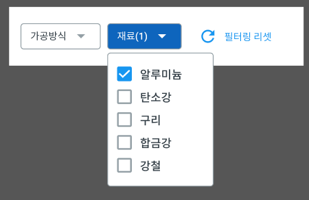

# 원티드 프리온보딩 프론트엔드 코스 3주차

## [ 팀과제 ] 고객의 조건에 맞는 요청서를 보여주는 페이지 구현

&nbsp;설 연휴가 지나고 프리온보딩 코스가 재개되었다. 꿀 같던 휴식들은 이제 안녕~. 다시 남은 3주동안 열심히 달려보려고 한다. 설 연휴 동안 부족한 실력을 메꾸기 위해 공부를 하려고 했는데, 생각만큼 공부를 많이 하지는 못해서 조금 걱정인 상태로 다시 시작하게 되었다.

&nbsp;이번 기업 과제는 고객의 조건에 맞는 요청서(카드 형식)를 보여주는 페이지를 구현하는 것이었다. 고객이 조건을 선택하면 그것에 맞는 요청서들만 화면에 보여주는 것이었다. 저번 팀과제에 비하면 꽤나 간단해 보여서 긴장이 조금 풀렸지만, 조건이 있었다.

### :exclamation: 과제 조건 :exclamation:

- **TypeScript** 구현 필수
- **figma**에 작성되어 있는 가이드에 따라 구현하기
- **json-server**를 이용해서 `mock rest-api server`를 띄워서 과제 진행

&nbsp;드디어 올게 왔다 싶었다. **TypeScript**는 저번 주에 공부를 하긴 했지만, 많은 시간을 투자하지 못해서 걱정이 앞섰지만 언젠가 만날거라고 알고 있었다. 과제가 많이 어려워 보이지 않은 덕분에 타입스크립트를 공부할 수 있는 좋은 기회라고 여겨졌다.

&nbsp;**피그마**도 처음 보는 거라 걱정했지만, 오히려 좋았던 것 같다. 외형이나 요구조건이 깔끔하면서도 필수적인 것은 잘 설명되어 있어서 맘에 들었다. 특히 `svg`를 빼올 수 있다는거!! 맘에 든다 너.

&nbsp;**json-server**는 프로젝트가 끝났지만 아직 안 친하다. 팀원 분 중 한 분이 맡아서 해주셨는데, 과제를 진행하느라 공부해보지 못했다. 일반적으로 api_url을 입력해서 데이터를 가져올 수 있지만, 이번에는 직접 `json-server`로 서버를 만들어서 가짜 데이터를 받아오는 형식으로 구축하라고 한 것 같다. 이거는 꼭 공부하려고 적어두었다!!

## :raised_hands: 팀원들과의 합의 사항

팀원들과 함께 프로젝트를 진행하기 위해 몇 가지 사항을 정해야 했다.

#### 컴포넌트 타입 지정 방식

타입 스크립트를 깔끔하게 사용하기 위해 다음과 같이 정했다.

```tsx
interface SampleComponentProps {
  onClick: React.MouseEventHandler;
  selected?: boolean;
}

const SampleComponent = ({ onClick, selected }: **SampleComponentProps**) => {
  return <div onClick={onClick}>{selected ? 'yes' : 'no'}</div>;
};
```

- `React.FC` 대신 Props용 `interface`를 사용하기
- 함수형 컴포넌트의 `return type`(JSX.Element)은 생략

#### 반응형 기준

```css
@media screen and (max-width: 767px) {
  /* 모바일 */
}
```

- `767px`을 기준으로 모바일 환경(반응형)을 구성
- PC 환경을 기준으로 CSS를 작성한 후 모바일 환경에 대한 CSS를 작성

#### storybook 제목

이번에 처음으로 스토리북을 사용해보기로 했다. 지금까지는 각자 맡은 컴포넌트를 개발하기 위해 App에다가 import 했다가 지우고 이렇게 복잡한 방식으로 진행했었다. 하지만 **Storybook**을 사용하면 위와 같은 절차가 없이도 **각자 UI개발을 독립적으로 진행할 수 있다**는 말을 듣고 도전해보기로 했다.

```jsx
export default {
  title: 'base/SampleComponent',
  component: SampleComponent,
} as ComponentMeta<typeof SampleComponent>;
```

- base/컴포넌트명
- domain/컴포넌트명

#### 개발 방식

1. 프로젝트 초기 세팅 (다같이) - [초기세팅 보러가기](./TeamProjectSettings.md)
2. `base` 컴포넌트 개발 (개인) - 버튼이나 토글과 같은 로직이 없는 컴포넌트
3. `domain` 컴포넌트 개발 (개인) - 하나의 로직이나 기능을 가진 컴포넌트
4. App에 합치기 (다같이)

## :running: 프로젝트 진행

&nbsp;나는 이번에 프로젝트의 고객의 원하는 조건을 선택할 수 있는 **드롭다운**메뉴와 **토글** 버튼을 만들게 되었다. 저번에는 체크박스와 라디오 버튼이었는데, 어째 이런것만 만들게 되는 것 같다. 이게 간단할 것 같지만 요구사항에 맞춰서 커스텀 하려면 생각보다 쉽지 않다는 걸 저번 과제에서 겪었기 때문이다.

&nbsp;일단 프로젝트를 시작하려는데, 초반부터 문제를 겪었다. 타입스크립트와 스토리북을 둘다 사용해보지 못해서 코드를 깔끔하고 좋은 로직을 짜기는 커녕 저 두개를 신경쓰느라 머리가 안돌아갔다.

### Storybook 사용하기

- Storybook: https://storybook.js.org/

우선 스토리북의 공식 문서를 읽어보려고 했다. 하지만 저번 과제에서 밤을 새면서 만들었는데도 제대로 기능 구현을 하지 못했던 것이 생각나서 나는 조급했었고, 다 읽고 해보지는 못할 것 같았다. 그래서 튜토리얼의 간단한 컴포넌트 만들기까지만 읽어보았다.

하지만 마음이 조급해서 그런가 제대로 머리에 들어오지 않았고, 일단 만들어나보자! 라는 생각으로 만들기 시작했다. 하지만 역시는 역시... 알지도 못하는데 뭐를 만드니... 결국 스토리북을 사용해보신 팀원 분이 샘플 컴포넌트와 샘플 스토리북 파일을 만들어서 공유해주셨다.

```jsx
// SampleComponent.tsx
import React from "react";
interface SampleComponentProps {
  onClick: React.MouseEventHandler;
  selected?: boolean;
}

const SampleComponent = ({ onClick, selected }: SampleComponentProps) => {
  return <div onClick={onClick}>{selected ? "yes" : "no"}</div>;
};

SampleComponent.defaultProps = {
  selected: false,
};

export default SampleComponent;
```

이러한 예제 컴포넌트가 있다. `props`로 `onClick` 이벤트를 가지고 있고, `selected`라는 선택이 됨을 나타내는 상태를 받는다면 다음과 같이 스토리북 파일을 만들 수 있다.

```jsx
// SampleComponent.stories.tsx
import React, { useState } from 'react';
import { ComponentStory, ComponentMeta } from '@storybook/react';
import SampleComponent from './SampleComponent';

// 스토리 제목과 컴포넌트를 가져와 입력한다.
export default {
  title: 'components/SampleComponent',
  component: SampleComponent,
} as ComponentMeta<typeof SampleComponent>;

// 스토리북을 실행했을 때 보여질 컴포넌트
const Template: ComponentStory<typeof SampleComponent> = (args) => (
  <SampleComponent {...args} />
);

// 여기부터는 이 컴포넌트의 상태에 따른 Use Case를 설정할 수 있다.
export const True = Template.bind({});
True.args = {
  onClick: () => {},
  selected: true,
};

export const False = Template.bind({});
False.args = {
  onClick: () => {},
  selected: false,
};

export const OtherExample = () => {
  const [isTrue, setTrue] = useState<boolean>(false);
  return (
    <SampleComponent
      onClick={() => setTrue((prev) => !prev)}
      selected={isTrue}
    />
  );
};
```

&nbsp;흠... 좋아. 대충 이해는 했다. 연결할 컴포넌트를 가져와서 연결해주고, `Template` 부분에는 실제 컴포넌트와 비슷하게 작성하고, 아래에는 사용 사례의 모습을 보여주면 된다고 이해했다. 이게 맞는 건지는 모르겠지만, 사용할 때 그런식으로 사용했는데, 다행히 이번 프로젝트는 큰 어려움은 없이 만들어 볼 수 있었다.

&nbsp;이번에 스토리북을 사용하면서 정말 편리함을 느꼈다. 저번 과제에서 스토리북 없이 각자 컴포넌트를 만들 때, *App.tsx*에 집어 넣고 빼가면서 만드라 `pull`과정에서 충돌이 많이 일어났었다. 그러나 이번에는 그럴 필요가 없으니 팀 프로젝트에서 정말 편안하게 **독립적으로 컴포넌트를 만들 수 있었다**. 그러나 새로운 문법과 파일을 하나 더 작성해야 한다는 것은 아직은 조금 어렵게 느껴진다. 다음에 조금 더 복합적인 컴포넌트를 스토리북을 통해 만들게 된다면 더 어려워질 것 같다. 얼른 시간날 때 공부해봐야겠다!!

### Custom Select Dropdown 만들기

토글은 스토리북을 익히기 딱 좋을 정도로 공부하면서 만들었고, 이거는 정말 힘들었다. 이거 때문에 진짜로 밤을 새고 아침 10시까지 만들었다. 그래도 금방하겠지 했는데, 진짜 이렇게 시간이 빨리갈 줄은 몰랐다. 밤을 샌 이유가 있는데, 이번 과제에서는 이 드롭다운에 조건이 있었기 때문이다.

#### Select Dropdown의 조건들



- [ ] 다중 선택 - 선택되도 select box가 열려있어야 함
- [ ] 기본 default로 보여질 선택 옵션과 화살표 이미지 변경
- [ ] 옵션들의 체크박스 CSS 커스터마이징
- [ ] 옵션을 선택하면 배경색 셀렉트 박스의 색 변경 및 선택한 개수 표시

#### select와 option 태그를 이용해서 만들기

&nbsp;처음에는 당연히 선택 박스니까 `select`와 `option` 태그를 이용해서 만들려고 했다. 그러나 역시 쉽게 한다는 것은 없었다. `select` 태그의 `placehoder`를 설정하고 싶었는데, `select` 태그에는 그러한 기능이 없었다. 타입스크립트에도 적응하느라 머리도 복잡했고, 스토리북은 아직 사용방법을 몰라서 그런지 실행해도 자꾸 화면에 보이지도 않았다. 그냥 리액트만 썼다면 훨씬 빨리 만들었을텐데 정말 두가지를 동시에 새로 배우는 것은 어려운 일이란 걸 느꼈다.:joy:

<details>
<summary><b>코드 보기</b></summary>
<div markdown="2">

#### select 컴포넌트

```tsx
import React, { useState } from "react";
import styled from "styled-components";
import type { MethodType, MaterialType } from "~types/index";

export interface IOption {
  value: string;
  // 선택을 정해둔 string안에서 할 수 있게 하기 위해 따로 타입을 설정했다.
  name: MethodType | MaterialType;
}

interface IOptionProps {
  title: string;
  options: IOption[];
  onChange: (e: React.ChangeEvent<HTMLSelectElement>) => void;
}

const Select = ({ title, options, onChange }: IOptionProps) => {
  return (
    <select defaultValue={title} onChange={onChange}>
      <option value={title} disabled hidden>
        {title}
      </option>
      {options.map((option) => {
        return (
          <option key={option.value} value={option.value}>
            {option.name}
          </option>
        );
      })}
    </select>
  );
};

export default Select;
```

#### storybook

```tsx
import React, { useState } from "react";
import { ComponentStory, ComponentMeta } from "@storybook/react";
import Select, { IOption } from "./Select";

export default {
  title: "base/Select",
  component: Select,
} as ComponentMeta<typeof Select>;

const Template: ComponentStory<typeof Select> = ({
  title,
  options,
  onChange,
}) => {
  const [selectedOptions, setSelectedOptions] = useState<string[]>([]);

  const handleChange = (e: React.ChangeEvent<HTMLSelectElement>) => {
    const selected = e.target.value;
    setSelectedOptions((prev) =>
      prev.includes(selected) ? prev : [...prev, selected]
    );
  };

  return <Select title={title} options={options} onChange={handleChange} />;
};

const METHOD_OPTIONS: IOption[] = [
  { value: "밀링", name: "밀링" },
  { value: "선반", name: "선반" },
];

const MATERIAL_OPTIONS: IOption[] = [
  { value: "알루미늄", name: "알루미늄" },
  { value: "탄소강", name: "탄소강" },
  { value: "구리", name: "구리" },
  { value: "합금강", name: "합금강" },
  { value: "강철", name: "강철" },
];

export const Method = Template.bind({});
Method.args = {
  title: "가공 방식",
  options: METHOD_OPTIONS,
};

export const Material = Template.bind({});
Material.args = {
  title: "재료",
  options: MATERIAL_OPTIONS,
};
```

</div>
</details>

##### select의 placeholder 설정하기

&nbsp;`select`태그의 `placeholder`를 설정하는 것은 결국 `option` 태그 중에 하나가 그 역할을 해줘야 했다. 나는 이 `option` 태그들을 데이터를 받아와서 `map` 함수를 이용해서 만들었었다. 그러나 이들 중 하나가 기본값이 되어줘야 했는데, 그럴려면 속성으로 `disabled`와 `hidden`을 가져야 했다.

&nbsp;태그 안의 속성에서만 삼항연산자를 써서 속성을 다르게 추가해보려고 했는데, 생각처럼 잘 되지 않았다. 결국 방법을 찾지 못했고, `map`함수의 밖으로 꺼내어서 따로 `disabled`와 `hidden` 속성을 추가하고 props로 받아온 `title`을 `value`와 태그 안에 텍스트로 주었다.

```tsx
<select onChange={onChange}>
  <option selected disabled hidden>
    {title}
  ...
</select>
```

&nbsp;간단히 보자면 이러한 상태인데, 잘 작동했다. 그러나 콘솔 창에 오류 메세지가 떴었다. `selected` 속성 대신에 `select` 태그에 `defaultValue`나 `value`를 사용하라는 메세지였다. 윽! 어떻게 간신히 잘 동작하게 만들어 놨더니 저건 사용하면 안된다니!! 속상했지만 다시 도전해보기로 했다.

&nbsp;결국 `option`태그에 `selected` 속성을 지우고 `value`로 `title`을 설정해주었고, `select` 태그에도 `defaultValue` 속성으로 `title`로 설정해줬는데, 다행히 깔끔하게 잘 동작했다! :stuck_out_tongue_closed_eyes:

##### 다중 선택 및 option 태그에 체크박스 추가하기

&nbsp;이제 다중 선택 및 체크박스를 추가하고 스타일링만 하면 되었다. 하하. 다중 선택을 먼저 해보려고 했는데, `multiple`이란 속성을 추가하면 동작하는 것 같았다. 그런데 역시 예상대로 제대로 동작하지 않아서 일단 제껴두고 체크박스를 추가하기 위해 시도 중이었다. 그러나 이거 때문에 몇시간을 투자했는데, 실패했다.

&nbsp;타입 스크립트와 스토리북에 지쳐서인가 방법을 찾지 못했다. 그런데 지금 글을 쓰면서 찾아봤는데, 다시 하라면 할 수 있을 것 같다. 나중에 다시 시도해봐야겠다. 헐.. 이런 좋은 방식이 있었다니... 나는 저때는 이 글을 찾지 못하고 혼자 `input`과 `label`만을 이용해서 다시 만들기 시작했었는데, 방식은 비슷하지만 `select`태그를 결합해서 사용할 수 있다니 **클릭 이벤트를 따로 일으킬 수 있어서 좋은 것 같다**.

- [옵션 태그 안에 체크박스 만들기](https://stackoverflow.com/questions/17714705/how-to-use-checkbox-inside-select-option)

#### input과 label을 통해 만들기

`select`와 `option`태그를 포기하고 나는 결국 `input`의 `type='checkbox'`를 이용하기로 결정했다.

##### input의 checkbox 커스텀하기

&nbsp;이 방식으로 하니까 쉽게 만들 수 있었다. `div`태그가 `select`처럼 css가 안먹는 것도 아니고 편하게 만드는 중이었는데, 1차로 어려움을 겪은 것은 체크박스의 CSS를 변경하는 것이었다. 내가 알기로 `input`의 체크박스는 스타일링 할 수 없었다. 그래서 여러번 시도 중에 과거에 만들었던 체크박스 방식이 떠올랐다.

&nbsp;이 방법은 **체크박스를 감추고 `label`이나 `div`로 스타일링된 체크박스를 새로 만드는 것**이었다.

```tsx
const Checkbox = styled.input.attrs({ type: "checkbox" })`
  position: absolute;
  width: 1px;
  height: 1px;
  margin: -1px;
  padding: 0;
  border: 0;
  clip: rect(0 0 0 0);
  clip-path: inset(50%);
  overflow: hidden;
  white-space: nowrap;
`;

const StyledCheckbox = styled.div<{ checked: boolean }>`
  position: relative;
  display: inline-block;
  width: 18px;
  height: 18px;
  margin-right: 12px;
  box-sizing: border-box;
  border-radius: 2px;
  ${(props) =>
    props.checked
      ? css`
          background: #2196f3;
        `
      : css`
          background: #fff;
          border: 2px solid #939fa5;
        `}
  transition: all 0.5s;
  cursor: pointer;
`;
```

위와 같이 코드를 작성해서 본래의 체크박스를 숨기고 스타일링한 체크박스를 위로 보이게 만들었다. 그런데 문제가 발생했다. 당연한 걸 수도 있지만, 기존 `input`의 체크박스는 `state`를 따로 만들지 않아도 `checked`라는 것을 가지고 있기 때문에 클릭을 통해 체크를 할 수 있다. 그러나 스타일링한 체크박스는 그러한 속성을 가지고 있지 않아서 클릭이 되지 않았다. 나는 이 문제로 한참을 헤맸는데, 생각해보니 쉬운 문젠데 왜 그랬을까 싶다. 이 문제는 **`input`의 `checked` 값을 스타일링한 체크박스에 연결시켜줌으로써 해결**했다.

##### map을 이용해서 만든 옵션들 중 하나만 상태 변경하기

```tsx
const MATERIAL_OPTIONS: IOption[] = [
  { value: "알루미늄", name: "알루미늄" },
  { value: "탄소강", name: "탄소강" },
  { value: "구리", name: "구리" },
  { value: "합금강", name: "합금강" },
  { value: "강철", name: "강철" },
];
```

&nbsp;이제 클릭을 통해 선택이 가능하게 만들었는데, 또 다른 문제가 발생했다. **하나를 클릭하면 모두가 선택되는 것**이었다. 나는 이러한 데이터를 받아와서 보여질 옵션들을 만들었었는데, 선택된다는 것을 따로 관리하려고 했었다. 이건 타입스크립트에 대한 두려움 때문에 저 데이터들을 건드릴 용기가 나지 않았었다. 결국 한참을 뚝딱 거리다가 나는 위험을 무릅쓰고 도전하기로 결정했다.

&nbsp;저 데이터에 있는 각 idnex의 객체에 `checked`라는 속성을 하나씩 넣어주었고, 체크박스들의 `checked`값을 위에서 부여한 값과 연결시켰다. 그리고 아래와 클릭한다면 아래와 같은 함수가 실행되게 만들었다.

```tsx
const handleChange = (e: React.ChangeEvent<HTMLInputElement>) => {
  setOptionList((prev) =>
    // 옵션들의 담긴 배열
    prev.map((option) =>
      // 각 옵션의 id가 클릭된 타켓의 id와 같은지 확인
      option.id === e.target.id
        ? // 같다면 옵션의 다른 속성(name, id)는 놔두고 checked만 현재 상태와 반대로 변경
          { ...option, checked: !option.checked }
        : // 다르다면 그대로 둠
          option
    )
  );
};
```

#### 옵션이 체크된 상태와 선택된 옵션들의 개수 표시하기 (array.some, array.reduce)

이제 선택된 옵션이 하나라도 선택되면 선택 박스의 스타일을 변경하고 옵션들의 개수가 표시되게 만들어야 했다. 그래서 어떻게 만들까하고 만들기 시작하는데, 딱히 방법이 떠오르지 않아서 두가지 다 상태를 새로 만들어서 관리했다.

```tsx
// 옵션들을 나타내는 상태
const [optionList, setOptionList] = useState(options);
// 하나라도 체크됐는지 확인하는 상태
const [checkOption, setCheckOption] = useState(false);
// 체크된 옵션들의 개수를 가지고 있는 상태
const [checkedOptionNum, setCheckedOptionNum] = useState(0);

useEffect(() => {
  // 체크된 옵션들의 배열을 return
  const checkedOptionStates: boolean[] = optionList.map((option) => {
    return option.checked;
  });
  // 위 배열에서 체크된 옵션들만 남김
  const checkedOptions: boolean[] = checkedOptionStates.filter(
    (checked) => checked === true
  );
  // 체크된 옵션의 개수가 0 이상이면 상태 변경
  setCheckOption(checkedOptions.length > 0 ? true : false);
  // 선택된 옵션들의 개수를 상태에 저장
  setCheckedOptionNumb(checkedOptions.length);
}, [optionList]);
```

&nbsp;정말 이 코드는 너무 아쉬웠다. 뭔가 필요없을 것 같은데, 로직이 떠오르지 않아서 괜히 상태를 만들어서 관리한다는게 맘에 안들었다. 이렇게 하고 풀리퀘를 올렸는데, 팀원분이 좋은 방법이 있다고 나를 도와주셨다. 배열의 메서드인 `some`과 `reduce`를 이용하라는 것이었다.

<div align="center">

</div>

&nbsp;그런걸로 저 상태를 없애버릴 수 있다고?? 코드를 보고 정말 나는 감탄할 수 밖에 없었다.

```jsx
// 옵션들 중 하나라도 체크되었는지 확인해서 변수에 담음
const isChecked = options.some((option) => option.checked);
//
const countChecked = useCallback(() => {
  // 각 옵션들의 checked 값을 더해서 count 변수에 저장
  const count = options.reduce((prev, cur) => prev + (cur.checked ? 1 : 0), 0);
  return count ? `(${count})` : "";
}, [options]);
```

<div align="center">

</div>

&nbsp;와우... 코드를 적용하고 정말 속 시원해서 감동해버렸다. 진짜 지저분해보여서 맘에 안들었는데, 이렇게 깔끔하게 만들 수 있다니 도와주셔서 감사합니다 엉엉 ㅠㅠ. 저 메서드들을 사용 방법은 알고 있었지만 이렇게 적용지는 못했었는데, 너무 좋은걸 배워버렸다. 자바스크립트를 아무래도 더 공부해서 나도 이러한 상황에 자연스럽게 이런 코드를 짤 수 있는 능력을 길러야 겠다.

#### :pray: 배운점

##### select 태그의 placeholder 설정

- select의 `defaultVlaue` 설정
- option 태그의 `selected`는 사용불가
- 기본값으로 보여줄 option 태그에 `disabled`와 `hidden` 속성주기

##### input의 체크박스 커스텀하기

- 가짜 체크박스를 만들어서 체크박스 위에 보이게 하고 `checked` 값 연결해주기

##### Array.some(), Array.reduce() - 쓸데 없는 state 없애버리기

- 객체 배열에서 각 객체들에서 하나의 속성값이 특정 조건을 통과하는지 확인하고 boolean값으로 반환하기
  - `Array.some()`을 이용해서 주어진 함수를 통과하는지 확인
- 객체 배열에서 각 객체들에서 하나의 속성값의 개수 더하기
  - `Array.reduce()`를 이용해서 특정 프로퍼티의 값 더하기

##### 마우스 이벤트의 차이

이번에 작업하면서 선택 박스에 마우스를 호버하면 옵션들이 보이게 만들었는데, 마우스 이벤트의 차이점을 알게되었다. `onMouseEnter/onMouseLeave` 와 `onMouseOver/onMouseOut` 이 조합들의 차이를 나는 알지 못했었다.

- `MouseOver/Out` : 지정된 태그 요소(혹은 자신)는 물론이며, 자식 요소가 있다면 해당 자식요소의 영역까지 포함됨

- `MouseEnter/Leave` : 지정된 태그 요소(혹은 자신)의 영역에만 해당되며, 만약 자식요소가 있다면 해당 자식요소의 영역은 제외됨

### 주요 로직

#### 토글 버튼으로 상담중인 요청서만 보이게 하기

```tsx
// 토글의 상태
const [list, setList] = useState<ApiReturnType[]>([]);
const [inBusiness, setInBusiness] = useState<boolean>(false);

// 토글 버튼 활성화 / 비활성화시 상담중인 카드만 보여주기 on / off
const handleToggle = useCallback(() => {
  setInBusiness((prev) => !prev);
}, []);

// 화면에 보여줄 요청서(카드)를 필터링하는 함수
const handleItemCard = useCallback(() => {
  // API 데이터 받아와서 저장, 배열의 각 정보가 담긴 객체가 들어옴
  let result: ApiReturnType[] = list;
  // 토글이 활성화되면 상담중인 요청서만 골라서 result에 담기
  if (inBusiness) {
    result = result.filter(({ status }) => status === "상담중");
  }
  // 상담중인 요청서만 골라서 렌더링
  return result.map((item, idx) => <ItemCard key={idx} requestInfo={item} />);
}, [list, inBusiness]);
```

&nbsp;이번에 팀과제를 하면서 정말 많이 배운 것 같다. **배열에 메서드** `filter`를 **사용할 때 비구조화 할당(구조 분해)**를 통해 코드를 이렇게 간결하게 짤 수 있다니... **각 객체에서 가진 키 값들 중, 특정 조건을 통과하는 키 값을 가진 객체들로만 다시 배열을 재구성하는 방법**을 배웠다. 위에서 `some`을 통해서 특정 조건을 통과하는 키 값을 가지면 `boolean`값으로 반환하는 방법을 알게 되었는데, 또 배워간다!!

#### 고객이 선택한 조건에 맞는 요청서만 보이게 하기

```tsx
const [list, setList] = useState<ApiReturnType[]>([]);
const [methodList, setMethodList] = useState<OptionType[]>(METHOD_OPTIONS);

const handleItemCard = useCallback(() => {
  const methodFilter: MethodType[] = methodList
    // 조건들 중에 checked된 것들이 있으면 이름을 가져와서 배열로 만듬
    .map(({ name, checked }) => (checked ? name : ""))
    // 이름이 없는 애들은 제외, as MethodType을 통해 타입 할당 해줌
    .filter((one) => one !== "") as MethodType[];

  // 가공 방식 필터가 있을 때
  if (methodFilter.length) {
    // 가져온 API데이터에서 가공 방식(method) true(포함되어 있는)인 것만 배열로 만듬
    result = result.filter(({ method }) =>
      // 체크된 옵션들을 api 데이터의 method가 포함하고 있는지 체크해서 boolean 값 반환
      methodFilter.every((one) => method.includes(one))
    );
  }
  // api 데이터가 들어와있지만, 조건에 맞는 요청서가 없다면 기본 화면 보여주기
  if (list.length && !result.length) return <DefaultContainer />;
  // 조건에 맞는 요청서만 렌더링
  return result.map((item, idx) => <ItemCard key={idx} requestInfo={item} />);
}, [list, methodList, materialList, inBusiness]);
```

데이터를 가져와서 필터링 할 때, 고민했던 부분이 있다.

```jsx
methodFilter.every((one) => method.includes(one));
```

이 부분인데, 요구 사항에 조건을 포함한 모두를 보여주는 것인지, 조건을 모두 포함한 조건들만 보여주는 것인지 적혀있지 않았다. 즉, `AND` 인지 `OR`인지 알 수가 없었다. 우리는 다중 선택은 `AND`조건이 맞다고 생각했고, 위와 같이 코드를 작성했다. 만약 `OR`조건이 었다면 아래와 같이 작성하면 될 것 같다.

```jsx
methodFilter.some((one) => method.includes(one));
```

### :pray: 회고

&nbsp;타입스크립트와 스토리북, 배열 메서드 some과 every, 비구조화 할당을 사용할 수 있는 새로운 사례 등 정말 많은 걸 배울 수 있는 시간이었다. **공부한 걸로 과제한 게 아니라 과제를 하면서 더 많이 배울 수 있었던 것 같다.** 시간 날때 틈틈히 다시 보면서 잊지 않고 응용해보고 싶다.

&nbsp;이번 과제에서도 당연히 밤새서 과제를 했지만, 다음에는 밤새지 않고 하고 싶다. 코드가 안되면 끙끙대지 말고 다음 방법을 시도해봐야 하는데, 너무 당연히 될 것 같으니까 포기하지 못하는 내가 밉다. :sweat: 그래도 밤새서라도 해냈으니 잘한건가...?

<div align="center">

## :rocket: 배포

**보러가기**: https://partners-board-park-is-best.herokuapp.com/

## GitHub 저장소

**보러가기**: https://github.com/OnBoarding-Park-is-best/week2-partners-dashboard

</div>
<br>

### 참고

- [마우스 이벤트 mouseover/mouseout VS mouseenter/mouseleave 차이점](https://rgy0409.tistory.com/3028)
