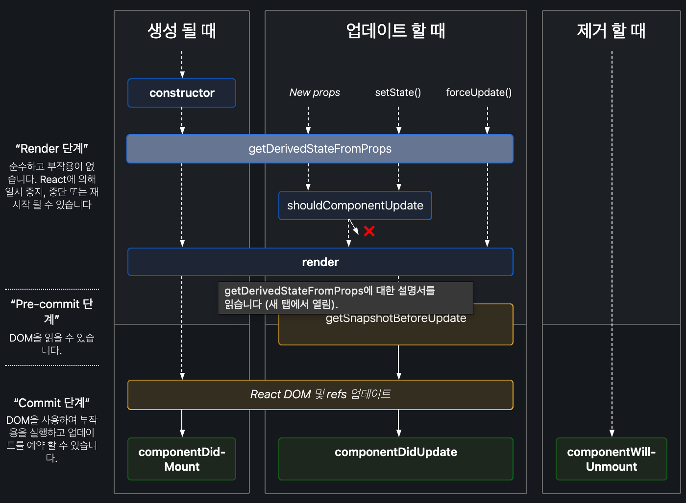

# [React] 함수형 컴포넌트와 클래스형 컴포넌트 Functional / Class Component

## 목차

- [함수형 vs 클래스형 컴포넌트 요약](#함수형-vs-클래스형-컴포넌트-요약)
- [왜 함수형 컴포넌트를 선호할까?](#왜-함수형-컴포넌트를-선호할까)
- [함수형 컴포넌트와 클래스형 컴포넌트의 차이](#함수형-컴포넌트와-클래스형-컴포넌트의-차이)
- [클래스형 컴포넌트를 공부해야 하는 이유?](#클래스형-컴포넌트도-공부해야-하는-이유)

### 들어가며

컴포넌트는 React로 만든 웹 애플리케이션의 핵심이다. 우리는 컴포넌트를 통해 UI를 재사용하고 독립적으로 작업할 수 있는 재사용 가능한 조각으로 나눌 수 있다.
React에서 컴포넌트를 생성하는 방법에는 클래스 컴포넌트와 기능 컴포넌트의 두 가지가 있다. 이 때문에 리액트를 처음 배우게 되면 어떤 선언 방식이 더 좋은 방식일지 고민하게 된다. 어떤 방식이 더 적합한 방식일까?

## 함수형 vs 클래스형 컴포넌트 요약

|                                        | 함수형 컴포넌트                                                                                                        | 클래스 컴포넌트                                                                                                          |
| -------------------------------------- | ---------------------------------------------------------------------------------------------------------------------- | ------------------------------------------------------------------------------------------------------------------------ |
| 설명                                   | 함수형 컴포넌트는 props를 인수로 받아들이고 React 요소를 반환하는 평범한 JavaScript 함수이다.                          | 클래스 컴포넌트를 사용하려면 React에서 확장해야 한다. 컴포넌트를 만들고 React 요소를 반환하는 렌더 함수를 만들어야 한다. |
| `render()` 메서드                      | 필요 x                                                                                                                 | 필요                                                                                                                     |
| 역할                                   | 상태 비저장 컴포넌트라고도 한다. 단순히 데이터를 받아들이고 어떤 형식으로든 표시하기 때문에 주로 UI 렌더링을 담당한다. | 논리와 상태를 구현하기 때문에 Stateful 구성 요소라고도 한다                                                              |
| Life Cycle (예: `componentDidMount()`) | 사용 불가능                                                                                                            | 사용 가능                                                                                                                |
| hook                                   | 사용 가능                                                                                                              | 생성자 구문 필요                                                                                                         |
| 생성자                                 | 사용 x                                                                                                                 | 상태 저장을 위해 사용                                                                                                    |

위와 같은 차이점을 가지고 있지만, 리액트 v16.8부터는 함수형 컴포넌트에 훅을 지원해서 현재는 공식 문서에서도 **함수형 컴포넌트와 훅(hook)을 함께 사용할 것을 권장**하고 있다.

## 왜 함수형 컴포넌트를 선호할까?

나는 최근에 리액트를 공부하기 시작했기 때문에, 함수형 컴포넌트와 클래스형 컴포넌트의 차이를 알고 사용하려 하기보다는 더 사용하기 쉬운 함수형 컴포넌트의 사용법을 배워서 사용하고 있었다. 그리고 요즘의 많은 개발자들도 클래스형 컴포넌트보다 함수형 컴포넌트와 리액트 Hook을 사용하는 것 같다. 왜 함수형 컴포넌트를 선호할까?

- 클래스형 컴포넌트는 **로직과 상태를 컴포넌트 내에서 구현하기 때문에 상대적으로 복잡한 UI 로직**을 가지고 있다.
- 함수형 컴포넌트는 state를 사용하지 않고 단순하게 데이터를 받아서(props) UI에 뿌려준다. Hook들을 필요한 곳에 사용하며 **logic의 재사용이 가능하다는 장점**이 있어서 함수형 컴포넌트와 Hook을 주로 사용한다고 한다.

### 컴포넌트의 기능

컴포넌트의 기능을 보자. 컴포넌트는 단순한 템플릿 이상의 기능을 수행한다.

- 데이터가 주어졌을 때, 이에 맞추어 UI를 만들어 준다.
- 라이프 사이클 API를 통해 컴포넌트가 화면에 나타날 때, 사라질 때, 변할 때 작업들을 수행할 수 도 있다.

### 컴포넌트의 분류

컴포넌트의 목적에 따라 **프레젠테이션(presentaitional) 컴포넌트**와 **컨테이너(container) 컴포넌트**로 나누기도 한다.

#### 프레젠테이션 컴포넌트

- view 만을 담당하는 컴포넌트(UI 구현)
- UI를 담당하는 만큼 스타일에 관련된 모든 것이 정의되어 있다.
- redux 스토어(app의 상태 트리를 보유한 곳)에 직접적으로 접근하지 않고, props로만 데이터, 함수를 가져온다.
- 순수한 컴포넌트로 state를 사용하지 않으며 state가 있을 경우 데이터가 아닌 UI에 대한 state여야 한다.
- 주로 함수형 컴포넌트로 작성된다.
- 이 컴포넌트 안에서는 프레젠테이션 컴포넌트와 컨테이너 컴포넌트 둘 다 사용할 수 있다.

#### 컨테이너 컴포넌트

- 다른 프레젠테이션 컴포넌트나 컨테이너 컴포넌트를 관리한다.
- 내부에 DOM 요소(UI)를 작성하지 않는다. (사용하는 경우 감싸는 용도)
- 스타일을 가지고 있지 않다.
- 상태를 가지고 있고, redux에 직접 접근하여 데이터를 가져온다.
- dispatch(액션을 발생 시키는 것)를 하는 함수를 구현한다.

## 함수형 컴포넌트와 클래스형 컴포넌트의 차이

### 1. 선언 방식

#### 클래스형 컴포넌트

```jsx
import React, { Component } from 'react';

class Square extends Component {
  render() {
    return (
      <button className="square" onClick{() => this.props.onClick()}>
        {this.props.value}
      </button>
    );
  }
};

export default Square;
```

- class 키워드 필요
- Component로 상속을 받아야 한다.
- render() 메서드 반드시 필요
- state, lifeCycle 관련 기능 사용 가능
- 함수형보다 메모리 자원을 더 사용한다.
- 임의 메서드를 정의할 수 있다.

#### 함수형 컴포넌트

```jsx
import React from 'react';

const Square = (props) => {
  return (
    <button className="square" onClick{props.onClick}>
      {props.value}
    </button>
  );
};

export default Square;
```

- state, lifeCycle 관련 기능 사용 불가 -> 리액트 훅을 통해 사용 가능
- 클래스형보다 메모리 자원을 덜 사용
- render() 메서드 필요 x 등으로 편리한 선언 방식

함수형으로 컴포넌트를 선언할 때는 일반적인 함수 선언 방식과, ES6의 화살표 함수(arrow function) 방식도 있다. **화살표 함수의 경우 함수를 파라미터로 전달할 때 유용하다.** 비슷하게 작동하지만, 두 문법이 다르다는 것을 다음 예제를 통해 알 수 있다.

```jsx
function BlackDog() {
  this.name = "흰둥이";
  return {
    name: "검둥이",
    bark: function () {
      console.log(this.name + ": 멍멍!");
    },
  };
}

const blackDog = new BlackDog();
blackDog.bark(); // 검둥이: 멍멍!

function WhiteDog() {
  this.name = "흰둥이";
  return {
    name: "검둥이",
    bark: () => {
      console.log(this.name + ": 멍멍!");
    },
  };
}

const whiteDog = new WhiteDog();
whiteDog.bark(); // 흰둥이: 멍멍!
```

:white_check_mark: 일반 함수는 자신이 종속된 객체를 this로 가리키며, 화살표 함수는 자신이 종속된 인스턴스를 가리킨다.

### 2. state

`state`는 **컴포넌트 내부에서 바뀔 수 있는 값**을 의미한다. `props`의 경우 부모 컴포넌트가 설정하고 자식 컴포넌트는 받아서 읽기만 할 수 있는 값이며 바꾸기 위해서는 부모 컴포넌트에서 직접 변경해야 한다. 자식 컴포넌트 내에서 값을 변경해야 하는 경우 `state`를 사용한다.

#### 클래스형 컴포넌트

로직과 상태를 컴포넌트 내에서 구현하기 때문에 Stateful 컴포넌트로도 불리며 상대적으로 복잡한 UI 로직을 가지고 있다.

- 클래스 내의 constructor(생성자) 안에서 state의 초깃값을 생성해야 한다.
- constructor 작성 시 `super(props)`를 반드시 호출해야 한다.
- state 조회는 `this.state`, state의 값 변경 시에는 `this.setState()` 함수를 통해 바꾼다.

```jsx
import React, { Component } from "react";

class Counter extends Component {
  constructor(props) {
    super(props);
    this.state = {
      number: 0,
    };
  }
  // onClick을 통해 버튼이 클릭되었을 때 호출할 함수
  Add = () => {
    // state에 새로운 값 넣기
    this.setState({ number: number + 1 });
  };

  render() {
    const { number } = this.state; // state 값 조회
    return (
      <div>
        <h1>{number}</h1>
        <button onClick={this.Add}>Add</button>
      </div>
    );
  }
}

export default Counter;
```

#### 함수형 컴포넌트

state를 사용하지 않고 단순하게 데이터를 받아서(props) UI에 뿌려주기 때문에 Stateless 컴포넌트라고도 불린다. 그러나 리액트 훅이 등장하면서 함수형 컴포넌트도 훅을 사용할 수 있게 되었다.

- useState를 이용해 state를 사용한다.
- useState를 호출하면 배열이 반환되는데 첫번째 요소는 현재 상태, 두번째 요소는 상태를 바꿔주는 setter 함수이다.
- useState의 괄호 안에 초깃값을 설정할 수 있다.

```jsx
import React, { useState } from "react";

const Counter = () => {
  const [number, setNumber] = useState(0);

  const Add = () => {
    setNumber(number + 1);
  };

  return (
    <div>
      <h1>{number}</h1>
      <button onClick={Add}>Add</button>
    </div>
  );
};

export default Counter;
```

:white_check_mark: state를 적절하게 사용한다면 해당 컴포넌트 내에서 데이터가 변경될 때 마다 그때그대 변경된 데이터를 UI에서 불러올 수 있기 때문에 적절히 사용하면 매우 유용하다.
:white_check_mark: 함수형 컴포넌트든 클래스형 컴포넌트든 state를 직접 조작하는 것이 아닌, 반드시 setState나 useState와 같은 setter 함수를 사용하여 조작해야 한다.

### 3. props

props는 프로퍼티(properties)를 줄인 표현으로 컴포넌트 속성을 설정할 때 사용하는 표현이다.

- props 값은 해당 컴포넌트를 불러와 사용하는 부모 컴포넌트에서 설정할 수 있다.
- 경우에 따라 propTypes를 통해서 타입스크립트처럼 props의 타입을 지정해 줄 수 도 있다.
- props는 읽기 전용으로 컴포넌트 자체 props를 수정하면 안되며, 수정되는 값은 state이다.
- 모든 React 컴포넌트는 자신의 props를 다룰 때 반드시 순수 함수처럼 동작해야 한다.

#### 클래스형 컴포넌트

```jsx
import React, { Component } from "react";

class ShowAge extends Component {
  render() {
    const { age, name } = this.props;
    return (
      <div>
        {name}의 나이는 {age}살 입니다.
      </div>
    );
  }
}

export default ShowAge;
```

- `this.props`를 통해 넘겨 받은 props 값을 불러올 수 있다.

#### 함수형 컴포넌트

```jsx
import React from "react";

const ShowAge = ({ name, age }) => {
  return (
    <div>
      {name}의 나이는 {age}살 입니다.
    </div>
  );
};

export default ShowAge;
```

- 매개변수에 destructuring을 통해서 바로 props 값을 불러올 수 있다.

### 4. 이벤트 핸들링

#### 클래스형 컴포넌트

- 함수 선언 시에 const를 작성할 필요없이, 함수명과 화살표 함수로 바로 선언이 가능하다.
- 요소에 적용할 때 `this.`를 붙여줘야 한다.

```jsx
import React, { Component } from "react";

class Counter extends Component {
  constructor(props) {
    super(props);
    this.state = {
      number: 0,
    };
  }
  // onClick을 통해 버튼이 클릭되었을 때 호출할 함수
  Add = () => {
    // state에 새로운 값 넣기
    this.setState({ number: number + 1 });
  };

  render() {
    const { number } = this.state; // state 값 조회
    return (
      <div>
        <h1>{number}</h1>
        <button onClick={this.Add}>Add</button>
      </div>
    );
  }
}

export default Counter;
```

#### 함수형 컴포넌트

- 요소에 적용할 때 this가 필요없다.

```jsx
import React, { useState } from "react";

const Counter = () => {
  const [number, setNumber] = useState(0);

  const Add = () => {
    setNumber(number + 1);
  };

  return (
    <div>
      <h1>{number}</h1>
      <button onClick={Add}>Add</button>
    </div>
  );
};

export default Counter;
```

#### 공통 사항

두 가지 방식다 주의해야할 점이 있다면 다음과 같이 이벤트 핸들링 시에 JSX에서 바로 함수를 선언하면 안된다.

```jsx
<button
  onClick={() => {
    setNumber(number + 1);
  }}
>
  Add
</button>
```

위와 같이 선언하게 되면 **해당 컴포넌트가 렌더링 될 때마다 함수가 새로 생성되게 되고, 새로운 메모리 공간을 차지하게 되므로 비효율적인 코드가 되게 된다**.

### 5. Life Cycle

- 클래스형 컴포넌트는 여러 종류의 `Life Cycle 메서드'를 가지며, 이 메서드를 오버라이딩(상속하여 재정의)하여 특정 시점에 코드가 실행되도록 설정할 수 있다.
- 함수형 컴포넌트는 훅(Hook)을 사용하여 원하는 시점에 코드를 실행되게 할 수 있다.



아래부터는 라이프 사이클 메서드를 기준으로 동작 시점을 기술할 것이고, 그에 해당하는 훅(`useEffect()`)의 사용 방법을 작성할 것이다. `useEffect()`의 두번째 인자를 어떻게 넘기는 지 잘 보자!

#### ComponentDidMount()

- 컴포넌트가 생성된 직후, DOM 트리에 삽입된 직후에 호출된다.
- 이 메서드가 호출되는 시점에는 우리가 만든 컴포넌트가 화면에 나타난 상태이다.

```jsx
useEffect(() => {
  // 실행할 코드
}, []);
```

#### ComponentDidUpdate()

- 컴포넌트의 props 또는 state가 변경되었을 때 업데이트 작업 완료 후 실행되는 메서드

```jsx
useEffect(() => {
  // 실행할 코드
}, [props명, state명, ...]) // 의존성이 걸린 것들을 인자로 넘겨준다.
```

#### ComponentWillUnmount()

- 컴포넌트가 브라우저 상(DOM)에서 사라질 때

```jsx
useEffect(()=> {
  // 실행할 코드
  return () => {
    // unmount 시(사라질 때) 실행될 코드
  }
}, [props명, state명, ...])
```

## 클래스형 컴포넌트도 공부해야 하는 이유?

리액트 훅이 등장하면서 본래 클래스형 컴포넌트에서만 사용할 수 있던 state나 life cycle 메서드 등 대부분의 문제를 해결할 수 있게 되었고, 함수형 컴포넌트를 많이 사용하는 추세가 되었다.
하지만 개발은 혼자하는 일이 아니다. 회사에서 수많은 사람들이 함께 일하며 코드를 작성하고, 그리고 이미 **오래된 리액트 코드의 경우 클래스형 컴포넌트로 이루어진 경우가 훨씬 많다**. 그러므로 그 코드를 이해하고 같이 협업하기 위해서는 두 가지 방식 모두 다 잘 알고 있어야 한다!

## 참고

- [[React] 클래스형 컴포넌트 vs 함수형 컴포넌트](https://devowen.com/298)
- [함수형 컴포넌트와 클래스형 컴포넌트의 차이](https://born-dev.tistory.com/27#recentEntries)
- [React.js 함수형 컴포넌트의 생명주기(Life Cycle)](https://guiyomi.tistory.com/21)
