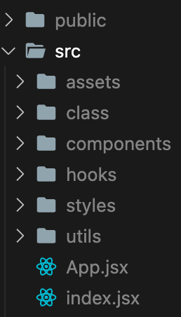

# [React] React 폴더 및 파일 구조

### 들어가며

HTML, CSS, JavaScript만 사용하다가 리액트를 처음 사용했을 때, 친숙해지기 어려웠던 것이 모르는 파일들과 폴더들이 내 프로젝트 폴더 안에 잔뜩 있었기 때문이었다. `node.modules`, `package.json`, `public`, `src`... 이 파일들과 폴더들이 어디에 쓰이는지 몰랐다. 이번에 한 번 제대로 공부해서 정리해보려고 한다.

## 목차

- [CRA 기본 폴더 및 파일 구성](#cra-create-react-app-기본-폴더-및-파일-구성)
- [React 폴더 및 파일 구조 설계](#react-폴더-및-파일-구조는-어떻게-설계해야-할까)
- [컴포넌트 설계](#컴포넌트-설계)
- [프로젝트 구조 설계](#프로젝트-구조-설계-패턴-폴더-및-파일-구조-설계)

## CRA (create-react-app) 기본 폴더 및 파일 구성


#### node.modules

- CRA를 구성하는 모든 **패키지 소스**가 존재하는 폴더
- 프로젝트를 실행하기 위해 필요한 패키지들이 설치 되어 있는 폴더

#### public

- 기본적으로 **정적 파일**들을 담고 있는데, 사용자에게 직접 웹브라우저 상에서 보이는 **HTML** 파일들이나 **image** 등이 이 디렉토리에 담긴다.

##### public 폴더의 특징

public 디렉토리에 넣은 파일들은 webpack에 의해 관리되지 않고 원본이 build 폴더에 복사된다. 그렇기에 다음과 같은 특징을 갖는다.

- 파일이 후처리(post-process) 되거나 경량화(minify)되지 않음
- 파일 경로를 잘못 입력하거나, 해당 파일이 존재하지 않을 경우 컴파일 단계에서 오류가 발생하지 않고, 사용자가 접근할 때 404 오류를 응답받게 됨.
- 결과 파일명에 content hash가 포함되지 않기 때문에, 파일이 수정될 때 마다 직접 파일명을 수정하거나 매개변수 쿼리를 추가해야 함.

##### public 폴더를 언제 사용할까?

- 특정 이름을 가진 파일이 필요할 때(manifest.webmanifest 처럼 build된 결과물에서 특정한 파일 이름이 필요한 경우)
- 이미지 파일이 수천 개 있어서 경로를 동적으로 참조해야 할 때
- **번들링**(Bundling; 기본적으로 여러 개로 흩어져 있는 파일들을 압축, 난독화 등을 하여 하나의 파일로 모아주는 역할) 된 코드 밖에서 pace.js 같은 작은 스크립트를 포함하고 싶을 때
- WepPack과 호환되지 않는 라이브러리를 사용해야 할 때(`<script>` 태그로 라이브러리를 포함해야 할 때)

##### public/index.html

- 사용자가 우리 프로젝트를 요청했을 때 최초로 보여지는 html

##### public/image

- image 파일들을 public 폴더에서 관리하고 접근하는 법을 알고 싶다면 [여기](https://bokjiho.medium.com/react-%EB%A6%AC%EC%95%A1%ED%8A%B8%EC%97%90%EC%84%9C-%EC%9D%B4%EB%AF%B8%EC%A7%80-%EA%B2%BD%EB%A1%9C-%EC%84%A4%EC%A0%95%ED%95%98%EA%B8%B0-public-src-%EB%94%94%EB%A0%89%ED%86%A0%EB%A6%AC-%EC%B0%A8%EC%9D%B4-fddb4f455c2a)를 참조하자!

#### src

##### src/index.js

- React의 시작 (js의 Entry Point)인 파일
- index.html과 컴포넌트 js와의 연결고리

##### src/App.js

- 최상위 컴포넌트 파일
- 현재 화면에 보여지고 있는 컴포넌트 파일을 넣어두는 곳
- Router를 사용하게 되면, App.js 대신 Router.js의 컴포넌트가 최상위 컴포넌트로 위치한다.

#### package.json

- 모든 프로젝트마다 package.json 하나씩 존재
- **프로젝트의 상세 정보들을 기입해둔 명세서와 같은 역할**
- 쉽게 말해서 **설치된 라이브러리/패키지 정보의 요약본**
- CRA 기본 패키지 외 추가로 설치된 라이브러리/패키지 정보(종류, 버전)가 기록되는 파일

#### gitignore

- github에 올리고 싶지 않은 폴더와 파일 작성

## React 폴더 및 파일 구조는 어떻게 설계해야 할까?

작은 프로젝트라면 괜찮겠지만, 프로젝트가 커지다 보면 파일들이 수도 없이 많아지게 되고 디렉토리들도 정말 많아지게 된다. 이렇게 점점 코드가 비대화되고 복잡도가 심화된다. 결국 **복잡한 코드들 사이에 의존성이 짙거나 목적을 잃은 코드들이 생기게 되면 사이드 이펙트가 생기게 될 수 있다**.
어떻게 하면 프로젝트 구조를 제대로 설계해서 이런 불화를 막을 수 있을까? 그 방법에 대해서 나는 **컴포넌트 설계**와 **프로젝트 구조 설계** 이 두가지로 나눠서 접근해보려고 한다.

### 컴포넌트 설계

<div align="center">

</div>

#### 컴포넌트란?

- **프로그래밍에 있어 재사용이 가능한 각각의 독립된 모듈**을 뜻한다.

#### 좋은 컴포넌트 설계 방법

##### 재사용성과 범용성

컴포넌트 설계의 핵심은 **재활용**이다. 즉, **재사용성**과 **범용성**을 갖춘 컴포넌트를 만들어야 한다. 기능만 동작하거나 하나의 UI만을 대체하는 용도가 아니라 몇 번이고 다시 쓰고, 어디에서든 가져다 쓸 수 있게 설계해야 한다.

##### 관심사 분리 및 단일 책임 설계

| Input   |          | Function                     |          | Output |
| ------- | -------- | ---------------------------- | -------- | ------ |
| `props` | &#10132; | **Component (with `state`)** | &#10132; | `JSX`  |

컴포넌트는 위에서 재사용이 가능한 각가의 독립된 모듈이라고 했다. 하지만 컴포넌트를 단순하게 봐보자. **`props`를 받고 `JSX`를 `return` 하는 함수**이다. 함수를 만들 때, 우리가 가장 중요하게 생각하는 것은 기능이다. 그러나 함수가 하나의 역할만은 하는 것도 그 못지 않게 굉장히 중요하다.
마찬가지로 **컴포넌트도 한 가지의 역할만을 수행해야 한다**. 동일한 props를 받으면 동일한 return 값을 내어주는 식으로 설계가 되어야 한다. 로직을 잘 나누고 역할을 잘 정의해서 컴포넌트를 만들면 코드가 너무 광범위한 역할을 수행하고 복잡해지는 걸 방지해 준다. **단일 책임**을 가지는 순수 컴포넌트들은 테스트하기 좋고 가독성도 좋다.
이러한 단일 책임을 가지는 순수 컴포넌트들을 만들기 위해서는 **프레젠테이션 컴포넌트(props만 받아서 렌더링 해주는)와 모델(hooks)로 설계**하는 방법이 있다. 이는 컴포넌트에서 로직을 깔끔하게 분리 가능하고, 로직의 재활용성과 가독성을 향상시킨다. 즉, 관심사를 분리시킬 수 있다.

##### 외부에 제어 위임

컴포넌트의 재사용성과 유연성을 위해서는 제어를 외부에 위임해야 한다. 제어를 외부에 위임한 컴포넌트들은 비즈니스 로직을 맡는 컴포넌트에 `import`해서 재사용이 가능하다. 재사용이 가능한 부분들은 따로 다 나눠서 컴포넌트로 만들거나 `hooks` 로직에 담으면 더 좋은 컴포넌트를 만들 수 있다.
그러나 제어를 위임하면 할수록 위임한 코드를 사용 하는 코드에 대한 이해 난이도가 높아가고, 가독성이 떨어지게 된다. **위임과 사용 용이성의 트레이드오프를 잘 생각해야 한다**.

| 제어 위임 | 재사용성                              | 유연성                                | 이해난이도                            | 가독성                                |
| --------- | ------------------------------------- | ------------------------------------- | ------------------------------------- | ------------------------------------- |
| 많음      | <span style="color: red">높음</span>  | <span style="color: red">높음</span>  | <span style="color: red">높음</span>  | <span style="color: blue">낮음</span> |
| 적음      | <span style="color: blue">낮음</span> | <span style="color: blue">낮음</span> | <span style="color: blue">낮음</span> | <span style="color: red">높음</span>  |

##### 성능 고려

리액트를 사용하는 이유 중에 하나는 virtual DOM에 의한 변경된 부분만이 렌더링 되는 것이다. 그렇다면 컴포넌트는 언제 리렌더링이 일어나는지 아는가? 컴포넌트는 기본적으로 state setter가 호출되면 리렌더링이 일어난다. 즉, **state가 변경될 때 컴포넌트가 다시 렌더링 된다**는 것이다.
하나의 state에 여러 개의 컴포넌트가 의존한다고 생각해보자. 그렇다면 state가 변경됨에 따라 여러 컴포넌트가 다시 렌더링 되야 할 것이고 이는 곧 성능의 저하를 의미한다. 그러므로 우리는 **성능을 위해 state와 이를 변경하게 만들 props를 최대한 변경하지 않을 수 있어야 한다**.

### 프로젝트 구조 설계 패턴 (폴더 및 파일 구조 설계)

폴더 구조는 어떻게 설계해야할까? 사실 정답은 없다. 프로젝트의 유형마다 다를 것이고 프로젝트의 크기마다도 다를 것이고 개인적인 취향에 따라서도 다를 것이다. 우선 [리액트 공식 문서](https://ko.reactjs.org/docs/faq-structure.html)를 보고 알아보자.

#### 파일이나 기능에 따라서 분류

```
common/
  Avatar.js
  Avatar.css
  APIUtils.js
  APIUtils.test.js
feed/
  index.js
  Feed.js
  Feed.css
  FeedStory.js
  FeedStory.test.js
  FeedAPI.js
profile/
  index.js
  Profile.js
  ProfileHeader.js
  ProfileHeader.css
  ProfileAPI.js
```

- CSS, JS 그리고 테스트 파일을 기능이나 라우트로 분류된 폴더에 같이 두는 방법

#### 파일 유형에 의한 분류

```
api/
  APIUtils.js
  APIUtils.test.js
  ProfileAPI.js
  UserAPI.js
components/
  Avatar.js
  Avatar.css
  Feed.js
  Feed.css
  FeedStory.js
  FeedStory.test.js
  Profile.js
  ProfileHeader.js
  ProfileHeader.css
```

- 더 세세하게 나누면 아토믹 디자인이라고 불린다.

<div align="center">
 
</div>

> Atomic design
> &nbsp;웹 사이트의 구성 블록이 HTML 요소들이며, 이 요소들은 원자라고 볼 수 있다. 원자가 결합되어 분자가 되는 것처럼 HTML 요소들은 결합되어 복잡한 페이지를 형성한다. 마찬가지로 각 페이지는 컴포넌트(또는 HTML 요소)로 분해될 수 있으며, 분해된 컴포넌트는 화학에서 가르치는 분자, 유기체와 유사하다.
> &nbsp;아토믹 디자인은 원자(Atoms), 분자(Molecules), 유기체(Organisms), 템플릿(Templates), 페이지(Pages)로 효과적인 인터페이스 시스템을 만든다.

#### 프로젝트 폴더 구조 다른 예시



이것은 참고로 나와 같이 팀원들이 함께 만들었던 프로젝트의 폴더 구조이다. 이리저리 변형되어서 아토믹 디자인을 참고해서 유사하게 폴더 구조를 잡았다.

##### assets

- 웹팩의 번들링에 대상이 될 정적 파일들을 이곳에 위치
- 프로젝트의 사용될 img가 들어가 있다.

##### components

- 컴포넌트 들이 담긴 폴더이다.
- 이 안에서 base와 domain 이라는 폴더를 나누었다.
  - base에는 아주 작은 최소 단위의 컴포넌트가 들어 있다.
  - domain에는 base들을 합쳐서 만든 page의 한 영역을 담당하는 컴포넌트들을 담았다.

##### hooks

- 각 컴포넌트에 사용될 로직이 담긴 곳
- 리액트의 커스텀 훅이 담긴 곳

##### styles

- 글로벌 style 및 특정 컴포넌트에 필요한 style이 담겨 있다.

##### utils

- 의존성 없이 여러 파일에서 공통적으로 사용 될 수 있는 함수나 상수를 담아놓은 파일
- utils성 함수의 분리 기준: **컴포넌트에서 두번 반복되는 경우 무조건 분리!**
- 이곳에 작성되어 있는 **util 함수**를 만드는 능력은 굉장히 중요하다. 이것은 주니어 개발자와 미들 레벨의 차이를 보여주기도 한다.

- **주니어**
  - 남의 코드(라이브러리 등)를 잘 가져다 쓰는 것
  - 남의 코드를 분석하고 내가 쓸 것을 구분해서 가져오기
- **미들 레벨**
  - 다른 이들이 사용할 수 있는 함수(utils 함수)를 만들어 줌

##### pages

여기에는 없지만 page가 여러 개인 프로젝트에는 pages라는 폴더를 만들어서 components에 담긴 컴포넌트들을 가져와서 렌더링 할 화면을 구성하기도 한다.

- 해당 page에서만 사용되는 컴포넌트의 경우 pages 폴더의 하위 폴더에서 관리한다.
- Next.js를 사용할 때 라우팅은 기본적으로 src/pages 폴더 구조를 그대로 따른다.

### 마치며

컴포넌트 설계를 위한 여러가지 방법들이나 폴더 구조를 통해 프로젝트의 파일과 폴더들을 어떻게 분리해서 기능 개발과 유지 보수를 편리하게 할 것인지에 대한 방법들은 너무나도 다양하다. 개인적인 판단을 넘어서 프로젝트의 유형이나 크기에 따라서도 어떻게 설계할 것인지에 대한 생각은 모두 다를 것이다. 다만, 나만 보는 프로젝트가 아닌 모두가 같이 사용할 프로젝트라는 것을 염두하고 좋은 설계를 위해 힘을 쓴다면 좋은 결과를 얻을 수 있지 않을까 싶다.

## 참고

- [[React] 2. CRA 기본 폴더 ∙ 파일 구성 및 동작원리](https://velog.io/@memoyoon/React-CRA-%EA%B8%B0%EB%B3%B8-%ED%8F%B4%EB%8D%94-%ED%8C%8C%EC%9D%BC-%EA%B5%AC%EC%84%B1-%EB%B0%8F-%EB%8F%99%EC%9E%91%EC%9B%90%EB%A6%AC)
- [[React] 리액트에서 이미지 경로 설정하기 (public, src 디렉토리 차이)](https://bokjiho.medium.com/react-%EB%A6%AC%EC%95%A1%ED%8A%B8%EC%97%90%EC%84%9C-%EC%9D%B4%EB%AF%B8%EC%A7%80-%EA%B2%BD%EB%A1%9C-%EC%84%A4%EC%A0%95%ED%95%98%EA%B8%B0-public-src-%EB%94%94%EB%A0%89%ED%86%A0%EB%A6%AC-%EC%B0%A8%EC%9D%B4-fddb4f455c2a)
- [리액트 어플리케이션 구조 - 아토믹 디자인](https://ui.toast.com/weekly-pick/ko_20200213)
- [리액트 설계 가이드](https://www.stevy.dev/react-design-guide)
