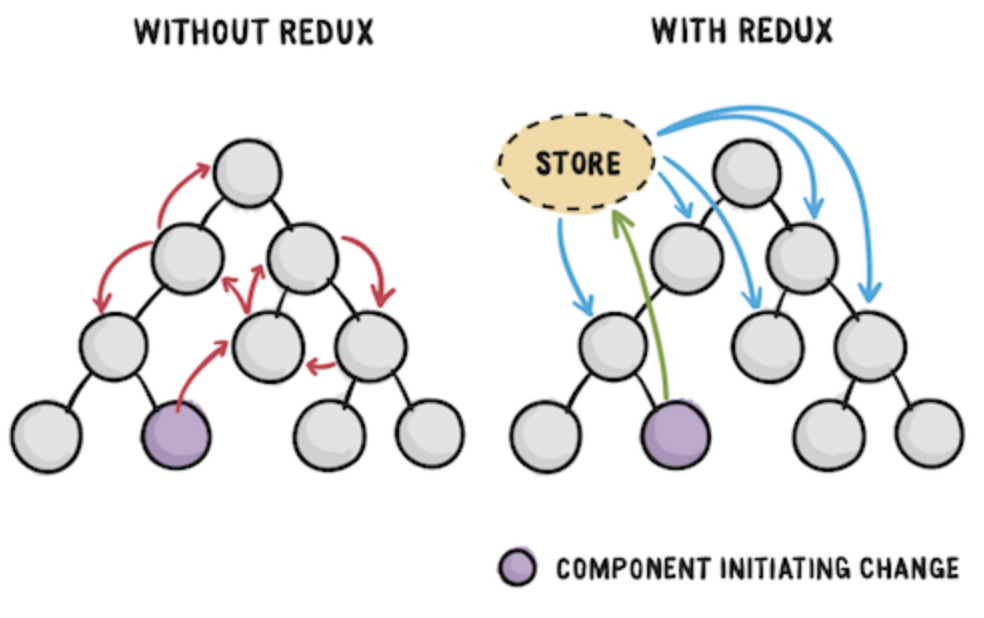

# [Redux] 리덕스

## 목차

- [Redux란](#redux란)
- [왜 리덕스를 사용할까?](#왜-리덕스를-사용할까)
- [언제 리덕스를 사용할까?](#언제-리덕스를-사용할까)
- [리덕스 데이터 흐름](#리덕스의-데이터-흐름)
- [리덕스 구성요소](#리덕스의-구성요소)
  - [액션](#액션-action)
    - [액션 생성 함수](#액션-생성함수-action-creator)
  - [리듀서](#리듀서-reducer)
  - [스토어](#스토어-store)
    - [디스패치](#디스패치-dispatch)
    - [구독](#구독-subscribe)
- [리덕스의 3가지 원칙](#리덕스의-3가지-원칙)
  - [순수 함수](#순수함수란)
    <br />

## Redux란?

- 리덕스란 **FLUX 패턴**을 근본으로 한 **자바스크립트 상태관리 라이브러**리이다.
- **전역 상태관리**를 지원해 모든 컴포넌트들이 상태를 쉽게 공유할 수 있게 해준다.
- React 내부 기술이 아니며 다른 UI라이브러리 및 Vanilla JS에서도 사용이 가능하다.

<br />

## 왜 리덕스를 사용할까?



리액트에 대해 조금 알아야 한다. 리액트는 단순 UI 라이브러리이기 때문에 데이터 관리를 고려하고 있지 않다. 또, **리액트의 데이터 흐름은 단방향**이기 때문에, 상위 컴포넌트에서 하위 컴포넌트들로 상위 컴포넌트의 상태를 props로 전달받게 된다. 상위 컴포넌트와 하위 컴포넌트의 관계가 얕다면 충분히 쉽게 상태를 전달하고 관리할 수 있다.

하지만 프로젝트를 진행하다보면 하위 컴포넌트의 하위 컴포넌트, 또 그 하위 컴포넌트... 같은 식으로 깊이가 깊어지고, 데이터나 UI 변화가 복잡하고 다양해지는 경우가 많다. 단일 페이지를 이루는 컴포넌트들의 데이터 교류 또한 복잡해지기 때문에 이를 효율적으로 관리할 방법 필요하게 된다.

이런 상황에서 리덕스는 **`store`** 라는 전역 상태 객체를 두고 애플리케이션 내에 어느 컴포넌트에서든 쉽게 상태를 사용할 수 있게 해주고, 이를 통해 우리는 애플리케이션 내에 상태관리를 쉽게 할 수 있다. 또, 리덕스를 사용하면 컴포넌트의 상태 업데이트 관련 로직을 다른 파일로 분리시켜서 효율적으로 관리할 수 있다.

#### 요약

- 애플리케이션 전역에서 쉽게 상태에 접근 가능
- 많아진 상태 구성 요소들을 보다 효율적으로 관리할 수 있도록 도와준다.
- 외부로의 상태 로직 분리를 통한 컴포넌트의 재사용성 및 범용성 증가

<br />

## 언제 리덕스를 사용할까?

- 하나의 상태(데이터)가 여러 컴포넌트에서 필요한 경우
- 페이지를 reload해도 api 호출 없이 유지해야 할 데이터가 있을 경우
- 페이지 레이아웃에 영향을 받지 않는 전역 UI 컴포넌트가 있을 경우
  - modal, toast, alert 등
- 앱 전체적으로 사용할 데이터 관리가 필요할 때
  - 로컬 스토리지에 데이터를 저장하고 불러오는 로직 대신 사용할 수 있다.

<br />

## 리덕스의 데이터 흐름


위에서 말했듯이, 리덕스는 Flux 패턴을 기반으로 만들어졌다. Flux는 페이스북에서 개발한 data flow를 위한 아키텍처이다. pattern이라고 불러도 좋다.

- **`Store`** : Application의 전체 state는 store라고 불리는 곳에서 관리된다.
  - store는 redux의 상태값(state)를 갖는 객체이다.
- **`Action`** : action은 state 변화를 일으킬 수 있는 행동정보, 현상등이라고 생각하면 된다.
- **`Dispatcher`** : action이 일어나면 Dispatcher를 통해서 store의 state가 업뎃된다.
- **`View`** : state가 변경되면 view에서 감지하고, 화면에 반영(rerender) 된다.

애플리케이션의 전체 state는 store라는 곳에서 관리된다. 액션은 state의 변화를 일으킬 수 있는 하나의 현상으로 action을 발행해서 store에 저장하고, state가 변경되면 view에서 감지하게 된다.

액션은 사용자가 일으키는 이벤트라고 생각해도 되는데, 위의 그림과 같이 view 단에서 action이 일어날 수도 있다(당연). view에서 action이 일어나면 -> 다시 dispatcher에 의해 store에 저장되고 -> state가 변경되면 -> 필요한 view에서 감지를 알아차린다.

<br />

## 리덕스의 구성요소


### 액션 (Action)

- **사용자의 입력이나 UI 조작, 웹 요청 완료같이 어떠한 상태 변화를 일으킬 수 있는 현상**
- 상태에 어떤 변화가 필요하게 될때 액션을 발생시키고, 이는 하나의 객체로 표현된다.
- 즉, 어떤 조작인지 정보를 갖고 있는 자바스크립트 객체이다.

#### 액션의 생김새

```js
{
  type: 'SHOW_MODAL',
}
```

- action 객체는 위와 같이 생겼다.
- 조작하고 싶은 정보는 `type` 프로퍼티에 지정한다.

#### 액션의 특징

```js
{
  type: 'ADD_USER',
  payload: {
    options: {
      name: 'brad',
      age: 23
    }
  }
}
```

- 액션은 **객체**이다.
- 액션 객체는 **`type` 필드를 필수**적으로 가지고 있어야하고, 일반적으로 `type`은 **어떤 행동을 설명하는(조작하고 싶은 내용) 문자열**이다.
- `type` 외의 값들은 개발자의 마음대로 넣어줄 수 있고, 주로 해당 액션에 필요한 부가적인 데이터를 전달하고 싶을 때 사용한다. (일반적으로 payload를 사용한다.)

#### 액션 생성함수 (Action Creator)

- 액션 생성함수는 **액션을 만드는 함수**이다.
- 단순히 파라미터를 받아와서 액션 객체 형태로 만들어준다.
- 리액트에서 사용할 액션은 객체 리터럴로 바로 정의하지 않고, 액션 생성함수를 통해 만든다.

```js
// showModal의 액션 생성자
export function showModal() {
  return { type: 'SHOW_MODAL' }  <- Action!
}
```

일반적으로 행동정보인 `type`만 가지고 있지 않고, 부가적인 정보를 포함하고 있다.

```js
export function showModal({ title }) {
  return { type: "SHOW_MODAL", title };
}

// 화살표 함수로도 만들 수 있다.
export const showModal = ({ title }) => ({ type: "SHOW_MODAL", title });
```

액션 생성은 이렇게 함수를 호출하면 된다!

```js
showModal({ title: "로그인" });
```

액션 생성함수를 만들어서 사용하는 이유는 **나중에 컴포넌트에서 더욱 쉽게 액션을 발생시키기 위해**서다. 그래서 일반적으로 함수 앞에 `export` 키워드를 붙여서 다른 파일에서 불러와서 사용한다.

리덕스를 사용할 때 액션 생성함수를 사용하는 것이 필수적이진 않다. 액션을 발생 시킬 때마다 직접 액션 객체를 작성할 수도 있다.

<br />

### 리듀서 (Reducer)

- reducer는 변화를 일으키는 함수로 **action이 발생했을 때 state를 변화시키기 위한 함수**이다.
- 즉, reducer는 새로운 state를 반환하는 함수!
- 액션 등의 일거리를 직접 수행하는 친구

#### 리듀서의 생김새

```js
function reducer(state, action) {
  // 상태 업데이트 로직
  return nextState;
}
```

- **state와 action 두 가지의 파라미터**를 받아온다.
- 액션의 내용(type)에 따라 상태를 변화시킨다.
- 리듀서는 현재의 상태와 전달 받은 액션을 참고하여 store에 접근에 액션에 맞춰 새로운 상태를 만들어서 반환한다.

#### 리듀서 정의

```js
function modal(state = null, action) {
  switch (action.type) {
    case "SHOW_MODAL": // SHOW_MODAL 이라는 action이 발행되면
      return {
        ...state,
        showModal: true, // 전역 state 중에서 showModal의 값을 true로 바꾼다.
      };
    case "CLOSE_MODAL":
      return {
        ...state,
        showModal: false,
      };
    default:
      return state;
  }
}
```

각 action type 별로 새로운 state를 생성하여 반환하게 리듀서를 작성해주면 된다.

위 코드의 경우 'SHOW_MODAL'이라는 액션 타입과, 'CLOSE_MODAL'이라는 액션 타입에 따라 반환하는 state가 다르다. 액션 타입에 따라 showModal이 `true` 혹은 `false`로 변경될 수 있다.

state가 없을 때 null로 세팅할 수 있지만, 초기 상태를 줄 수 있다.

```
const INTIAL_STATE = {
  showModal: true;
}

function modal(state = INITIAL_STATE, action) {
  ...
```

`useReducer`에선 일반적으로 `default:` 부분에 `throw new Error('Unhandled Action')`과 같이 에러를 발생시키도록 처리하는게 일반적인 반면 리덕스의 리듀서에는 기존 `state`를 그대로 반환하도록 작성해야 한다.

리덕스를 사용할 때에는 여러개의 리듀서를 만들고 이를 합쳐서 루트 리듀서(Root Reducer)를 만들 수 있다. 이 때 루트 리듀서 안의 작은 리듀서들은 서브 리듀서라고 부른다.

```js
const rootReducer = combineReducers({
  modal,
  user,
  messages,
});

export default rootReducer;
```

<br />

### 스토어 (Store)

리덕스에서는 한 애플리케이션 당 하나의 스토어를 만들게 되고, 이 **유일한 스토어를 사용하여 전체 상태 관리**를 한다.

```js
import { createStore } from "redux";
import modalReducer from "./ModalReducer";

const store = createStore(modalReducer);
```

- redux에서 제공하는 createStore 함수로 생성
- store를 생성할 때 인자로 리듀서를 전달하기 때문에, 리듀서가 필요하다.
- state를 수시로 확인해 View 한테 변경된 사항을 알려주는 녀석이라고 볼 수 있다.

스토어 안에는 현재의 앱 **상태**와, **리듀서**가 들어있고, 추가적으로 몇가지 **내장 함수**들이 있다.

#### 디스패치 (Dispatch)

- 디스패치는 스토어의 내장함수 중 하나다.
- 액션을 발생 시키는 함수
- 리듀서와 헷갈릴 수 있는데, 디스패치는 **리듀서에게 Action을 발행하라고 시키는 것**이다.

```js
dispatch(action);
```

dispatch에는 액션을 파리미터로 전달한다. 이렇게 호출을 하면, 스토어는 리듀서 함수를 실행시켜서 해당 액션을 처리하는 로직이 있다면 액션을 참고해서 새로운 상태를 만들어준다.

#### 구독 (subscribe)

- 구독 또한 스토어의 내장함수 중 하나이다.
- 일반적으로 리덕스에서 이 함수를 직접 사용할 일은 별로 없다.
  - react-redux라는 라이브러리에서 제공하는 `connect` 함수 또는 `useSelector` 훅을 사용하여 리덕스 스토어의 상태에 구독한다.

subscribe 함수는, 함수 형태의 값을 파라미터로 받아온다. subscribe 함수에 특정 함수를 전달해주면, **액션이 디스패치 되었을 대 마다 전달해준 함수가 호출**된다.

<br />

## 리덕스의 3가지 원칙

### 1. 전체 상태값이 하나의 객체로 표현된다.

하나의 애플리케이션에선 단 한 개의 스토어를 만들어서 사용한다. (한 개의 리액트 앱에 스토어가 하나!)

- 여러개의 스토어를 사용하는 것은 사실 가능하기는 하지만, 권장되지 않는다.
- 특정 업데이트가 너무 빈번하게 일어나거나, 애플리케이션의 특정 부분을 완전히 분리시키게 될 때 여러개의 스토어를 만들 수도 있다. -> 개발 도구를 활용하지 못하게 됨

### 2. 상태(state)는 읽기전용이다.

리액트에서 state를 업데이트 해야 할 때, setState를 사용하고, 배열 업데이트 시에는 배열 자체에 push를 직접 하지 않고, concat과 같은 함수를 사용하여 기존의 배열을 수정하지 않고, 새로운 배열을 만들어서 교체하는 방식으로 업데이트 한다. 엄청 깊은 구조로 되어있는 객체를 업데이트 할 때도, 기존의 객체는 건드리지 않고, `Object.assgin`을 사용하거나 spread 연산자 (`...`)를 사용하여 업데이트 한다.

- 기존 컴포넌트에서의 state 관리를 생각하면 된다.

리덕스에서도 마찬가지다. **기존의 상태로 건드리지 않고, 새로운 상태를 업데이트 해주는 방식**으로 해주면, 나중에 개발자 도구를 통해서 뒤로 돌릴 수도 있고 다시 앞으로 돌릴 수도 있다.

리덕스에서 불변성을 유지해야 하는 이유는 **내부적으로 변경되는 것을 감지하기 위해 [shallow equality](https://redux.js.org/faq/immutable-data#how-redux-uses-shallow-checking) 검사를 하기 때문**이다. 이를 통해 객체의 변화를 감지 할 때 객체의 깊숙한 안쪽까지 비교를 하는 것이라 아니라 겉핥기 식으로 비교를 하여 좋은 성능을 유지할 수 있다.

### 3. 상태값(state)은 순수 함수에 의해서만 변경되어야 한다.

상태값을 변경시키기 위해서 사용하는 **리듀서는 순수 함수**여야 한다.

#### 리듀서가 순수 함수가 되기 위한 3가지 사항

- 리듀서 함수는 이전 상태와, 액션 객체를 파리미터로 받는다.
- 이전의 상태는 절대로 건드리지 않고, 변화를 일으킨 새로운 상태 객체를 만들어서 반환한다.
- 똑같은 파리미터로 호출된 리듀서 함수는 언제나 똑같은 결과값을 반환해야 한다.

#### 순수함수란?

: **항상 같은 input은 항상 같은 output을 반환하는 함수.**

당연하다고 느낄수도 있지만, 일부 로직들 중에는 실행 할 때마다 다른 결과값이 나타날 수 있다. `newDate()`, `Math.random()`, 네트워크 요청 등... 이러한 작업들은 순수하지 않은 작업으로, 리듀서 함수의 바깥에서 처리해줘야 한다. 이를 위해 리덕스 미들웨어를 사용한다.
