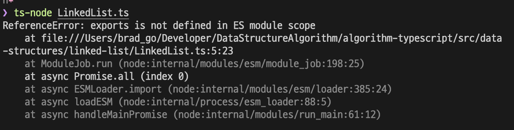

# 타입스크립트 단독으로 실행하기

타입스크립트를 사용할 때, 항상 불편했던 점이 있다. 타입스크립트를 터미널의 노드js 런타입에서 단독으로 실행할 수 없던 것이다. 항상 타입스크립트를 자바스크립트 파일로 변환해서, 변환된 자바스크립트 파일을 `node` 명령어를 통해 실행했었다.

자바스크립트 파일이 계속 생겨나 지저분해 보이는 것도 싫고, 변경하는 과정도 귀찮아서 타입스크립트만 단독으로 실행하는 방법이 알고 싶었다. 구글링을 통해서 스택 오버 플로우나 여러 블로그들을 보고 이 문제를 해결할 방법을 찾게 되었다.

그리고 매번 컴파일하는 과정도 번거로울 수 있는데, 이 문제도 해결할 방법을 정리해본다.

## ts-node로 타입스크립트 노드js 런타임에서 실행하기

```bash
yarn add -D ts-node
```

방법은 생각보다 간단하다. 위의 패키지를 설치해줘야 한다.

```json
"scripts": {
  "start": "ts-node --files ./src/**/**/*"
}
```

설치를 했다면 `package.json` 파일의 scripts 부분에 위와 같이 작성해준다. `start` 부분은 원하는 명령어를 입력하면 된다. 나는 `yarn start`와 같이 사용하기 위해 위와 같이 작성했다.
또 `./src/**/**/*` 이 부분은 타입스크립트 파일을 찾아 실행할 경로를 의미한다. 경로 기준은 `node_modules`나 `package.json`이 설치된 최상위 루트를 기준으로 기재한다. 나는 저런 폴더 구조를 가지고 있었기에 위와 같이 경로를 지정해주었다.

```json
"scripts": {
  "start": "ts-node --files ./src/index.ts"
}
```

프로젝트를 진행 중이라면 위와 같이 작성해주면 된다. src폴더 내의 index.ts가 진입점이 파일이 되어 src 하위의 모든 ts확장자를 가진 파일을 컴파일 할 것을 뜻한다.

### tsconfig.json 파일 수정

```json
{
  "compilerOptions": {
    "target": "esnext",
    "module": "commonjs",
    "esModuleInterop": true,
    "strict": true,
    "skipLibCheck": true
  },
  "include": ["src"]
}
```

나의 `tsconfig.json` 파일을 위와 같다. "include"를 통해서 내 프로젝트의 필요한 파일들을 포함하고 있는 위치를 알려주었다.

이제 다음 명령어를 통해서 ts파일을 노드 런타임 환경에서 실행시킬 수 있다.

```bash
yarn start
```

## 노드몬으로 자동 컴파일 실행하기

```bash
yarn add -D nodemon
```

노드몬을 설치해준다.

```json
"scripts": {
  "start": "ts-node --files ./src/index.ts",
  "build": "tsc-p",
  "dev": "nodemon"
}
```

`package.json`파일에서 노드몬을 실행할 수 있도록 위와 같이 작성해준다.

```json
{
  "watch": ["src/**/*.ts"],
  "ext": ".ts, .js",
  "ignore": [],
  "exec": "ts-node --files ./src/**/**/*"
}
```

`nodemon.json`파일을 최상위 루트에 생성하고, 위와 같이 작성해준다. 작성한 것은 다음의 순서다.

- 바라볼 경로
- 변경사항을 감지할 파일의 확장자
- 무시할 파일
- 실행 방식

```bash
yarn dev
```

위의 명령어를 입력하면 노드몬이 실행되고, 타입스크립트 파일을 감지하고 변경이 될때마다 실시간으로 컴파일된 결과를 보여주게 된다.

## 트러블 슈팅



나는 이 문제를 해결하려다가 `package.json`을 수정했었다. 타입스크립트에서 import, export를 사용하려고 하는데 위 스크린샷과 같은 문제가 발생했었기 때문이다.

그래서 스택오버 플로우를 참조한 결과 `package.json` 파일에 `"type": "module"`을 입력해주면 해결할 수 있다고 알게 되었고, 그것에 따라 작성한 후에 위 과정을 실행했었다.

그러나 nodemon이나 스크립트를 아무리 수정해도 위 문제가 해결되지 않았었다. 그래서 혹시나 해서 `tsconfig.json`에 `esModuleInterop`을 `true`로 변경해주고, `package.json`에 입력했던 `"type": "module"`을 제거했다.

그랬더니 마법같이 위 문제가 해결되었다. 아마 스택오버 플로우 글을 제대로 이해하지 못한 것 같다...

## 참고

- [Dico님 블로그](https://velog.io/@grinding_hannah/TypeScript-nodemon-ts-node-%EB%AA%A8%EB%93%88-%EC%84%A4%EC%B9%98%ED%95%98%EA%B8%B0)
- [Cannot use import statement outside a module in TypeScript](https://bobbyhadz.com/blog/typescript-cannot-use-import-statement-outside-module)
