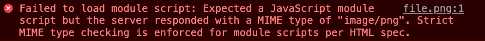
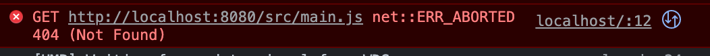
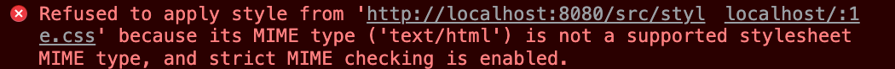
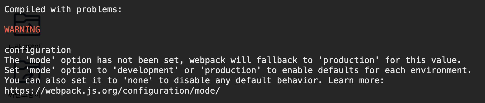

# [Webpack] JavaScript에서 로컬 이미지 사용하기 (웹팩 이미지 경로 설정하기)

## 들어가며

바닐라 JS 프로젝트를 진행하면서 정말 깜짝 놀랐던 것은 로컬 이미지들(assets나 이미지 폴더 내에 넣은 이미지들)을 불러올 수 없다는 거였다. 경로를 잘못 입력했나 하고 css에서 그대로 경로를 입력해서 확인해보면 경로가 잘못되지 않았다.

웹 상의 이미지 주소를 복사해서 사용하면 잘되지만, 로컬 내에 이미지를 사용하려면 어떻게 해야할까? 그래서 인터넷에 '웹팩 이미지 경로 설정'이라고 검색하면 관련 글들이 여럿 나왔는데, 나의 경우 무언가 잘못되었는지 이미지가 불러와지지 않았다.

## 프로젝트 구조

```bash
// 대략적인 것만 표기
.
├── node_modules
├── assets
├── src
│    ├── api
│    ├── components
│    ├── App.js
│    ├── index.js
│    └── style.css
└── index.html
```

현재 이러한 프로젝트를 진행 중이고, index.html은 아래와 같다.

```html
<!-- index.html -->
<!DOCTYPE html>
<html lang="en">
  <head>
    ...
    <link rel="stylesheet" href="src/style.css" />
  </head>
  <body>
    <main class="App"></main>
    <script type="module" src="src/index.js"></script>
  </body>
</html>
```

JavaScript에서 컴포넌트 방식으로 구현하기 위해 이러한 마크업 구조를 사용하고 있다. index.js와 그 하위 js 파일에서 모든 다른 html 요소를 생성하고 상태를 관리한다.

## 이미지를 불러오지 못하는 오류

```js
// Sample.js
export default function Sample({ $app, initialState }) {
  // 불필요한 코드 생략...
  this.$target = document.createElement("div");

  this.render = () => {
    this.$target.innerHTML = `<div></div>`;
  };
  this.render();
}
```

components 폴더 아래에 있는 Sample.js파일이다. 여기서 assets 폴더 내에 있는 png파일을 불러와서 사용하려고 했다. 당연히 이미지가 불러와졌겠거니 하고 확인을 해보는데 이미지가 깨져있었다. 경로가 잘못되었나 하고 몇 번을 확인해도 문제는 없었다.



위의 오류는 전혀 사라질 생각을 하지 않았다. 막막했지만 해결해 나가보자 했고, 구글링을 통해 웹팩 설정을 해줘야 한다는 것을 알게 되었다.

## 웹팩 설정하기

웹팩을 한 번도 다뤄보지 않았고, config파일만 보면 머리가 안 돌아가는 타입이라 걱정이 앞섰다. 그래도 해결하지 못하면 진행할 수 없으니 웹팩 공식 문서와 블로그 글들을 찾아보기 시작했다.

### 패키지 설치하기

```bash
npm i -D webpack webpack-cli file-loader
```

우선 웹팩과 이미지 파일을 불러와야 하니 file-loader가 필요할 것 같아서 설치했다. 그리고 다음과 같이 webpack.config.js 파일을 설정했다. (webpack.config.js는 package.json과 같은 위치에 생성)

### webpack.config.js 파일 작성

```js
// webpack.config.js
const path = require("path");

module.exports = () => ({
  mode: "none",
  entry: "./src/index.js",
  output: {
    filename: "bundle.js",
    path: path.resolve(__dirname, "dist"),
  },
  module: {
    rules: [
      {
        test: /\.(png|jpg|svg|gif)$/i,
        use: {
          loader: "file-loader",
        },
      },
    ],
  },
});
```

위와 같이 웹팩 설정을 해주었다. `entry`는 진입 경로를 의미하고, `output`은 결과가 담길 곳을 의미한다. `path`를 통해 파일의 절대 경로를 가져왔다. 이 부분은 대체로 이렇게 작성하는 것 같고 **file-loader**를 사용하는 부분은 아래와 같다.

```js
module.exports = () => ({
  ...
  module: {
    rules: [
      {
        test: /\.(png|jpg|svg|gif)$/i,
        use: {
          loader: "file-loader",
        },
      },
    ],
  },
});
```

이렇게 작성하면 png, jpg, svg, gif 파일들을 file-loader를 통해서 불러올 수 있다고 생각했다. 그러나 console 창을 확인해보면 여전히 이미지가 보이지 않았고, src 아래에서 assets 폴더를 찾고 있었다. 혹시나 해서 경로를 다시 설정해보면 위의 오류를 또 만날 수 있었다.

## pacakage.json

웹팩을 사용하려면 찾아보다 보니 package.json 파일에서 수정을 조금 해줘야 했다.

### 패키지 설치

```bash
npm i -D webpack-dev-server
```

웹팩 데브 서버 패키지를 설치해주었다.

### pacakage.json 수정하기

```json
"scripts": {
  "start": "webpack serve",
  "build": "webpack --mode production"
},
```

package.json의 `scripts` 부분을 다음과 같이 수정해서 웹팩 데브 서버를 통해서 결과물을 확인할 수 있도록 설정해주었다.

## plugin

이렇게 설정하고 나니까 이상한 페이지가 떴다. assets 폴더 내에 파일들을 보여주는 화면이 나타났다. 어떻게 한 건지는 모르겠는데, 지금 잘 기억이 나지 않는다. 그래서 조금 더 건드려보니까 아예 화면이 로드되지 않으면서 오류가 발생했다.

자세히 보다보니 html 파일을 읽어들이지 못하는 것 같았다. 그래서 찾아보니 html 파일을 읽어들이는 plugin을 설치해줘야 했다.

### 패키지 설치

```bash
npm i -D html-webpack-plugin
```

html-webpack-plugin이라는 패키지를 설치해주었다.

### webpack.config.js 수정

```js
// webpack.config.js
const path = require("path");
const HtmlWebpackPlugin = require("html-webpack-plugin");

module.exports = () => ({
  // ... 위의 코드 생략
  module: {
    // ...file-loader 부분 생략
  },
  plugins: new HtmlWebpackPlugin({ template: "./index.html" }),
});
```

위와 같이 html-webpack-plugin을 불러오고 plugins 부분에 **template** 프로퍼티에 값으로 현재 프로젝트에서 읽어들일 html 파일의 경로를 작성해주었다.

## script 제거



index.js(위 스크린샷에서는 main.js) 파일에서 원인을 알 수 없는 오류들이 보였다.

원인은 webpack 설정을 했기 때문이었다. 사용하려고 한 웹팩 설정이 문제라니?

```js
// webpack.config.js
module.exports = () => ({
  entry: "./src/index.js",
  output: {
    filename: "bundle.js",
    path: path.resolve(__dirname, "dist"),
  },
  // ... 생략
});
```

이 부분을 자세히 보자 이미 웹팩에서 엔트리 포인트(진입 경로)를 설정해주었고, 이 파일들에 자동 진입하므로 index.html에 `<script>`태그를 추가 할 필요가 없었고, 하면 위와 같이 오류가 발생했던 거였다. 결국 index.html에서 script 태그를 지워버림으로써 해결할 수 있었다.

## CSS 설정



이번에는 css에서 이상한 오류가 발생했다. MIME 타입이 뭔지도 몰랐다. 알고 싶다면 [여기](https://developer.mozilla.org/ko/docs/Web/HTTP/Basics_of_HTTP/MIME_types)에 보면 자세한 설명이 나와있다. 일단 내가 이해한 것은 HTML 파일에서 stylesheet를 불러오지 못해 스타일을 적용할 수 없다는 거였다.

### 패키지 설치

```bash
npm i -D css-loader style-loader
```

### webpack.config.js 수정

```js
module.exports = () => ({
  // ...생략
  module: {
    rules: [
      {
        test: /\.css$/,
        use: ["style-loader", "css-loader"],
      },
      // ... 생략
    ],
  },
  // ... 생략
});
```

두 패키지를 설치하고 위와 같이 webpack.config.js 파일을 수정해주었다.

## mode 설정



```js
// webpack.config.js
module.exports = () => ({

  mode: "development",
```
